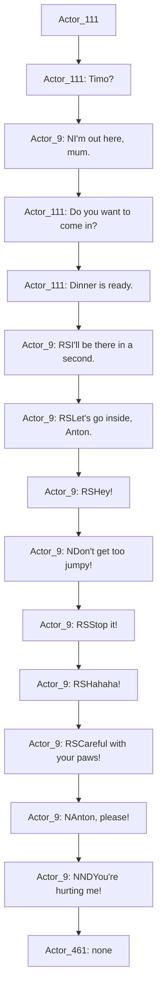

# ATOPIA/Backyard

```mermaid
graph TD
    92_0["Actor_111"]
    92_1["Actor_111: Timo?"]
    92_2["Actor_9: NI'm out here, mum."]
    92_3["Actor_111: Do you want to come in?"]
    92_4["Actor_111: Dinner is ready."]
    92_5["Actor_9: RSI'll be there in a second."]
    92_6["Actor_9: RSLet's go inside, Anton."]
    92_7["Actor_9: RSHey!"]
    92_8["Actor_9: NDon't get too jumpy!"]
    92_9["Actor_9: RSStop it!"]
    92_10["Actor_9: RSHahaha!"]
    92_11["Actor_9: RSCareful with your paws!"]
    92_12["Actor_9: NAnton, please!"]
    92_13["Actor_9: NNDYou're hurting me!"]
    92_14["Actor_461: none"]
    92_0 --> 92_1
    92_1 --> 92_2
    92_2 --> 92_3
    92_3 --> 92_4
    92_4 --> 92_5
    92_5 --> 92_6
    92_6 --> 92_7
    92_7 --> 92_8
    92_8 --> 92_9
    92_9 --> 92_10
    92_10 --> 92_11
    92_11 --> 92_12
    92_12 --> 92_13
    92_13 --> 92_14
```