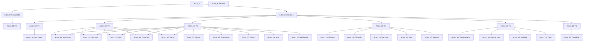

# ATOPIA/Bark/Provoke

```mermaid
graph TD
    26_0["Actor_9"]
    26_2["Actor_9: Eat shit."]
    26_3["Actor_10: Watch me."]
    26_4["Actor_9: Ganymede"]
    26_5["Actor_10: Daphne"]
    26_6["Actor_10: Trojan whore."]
    26_10["Actor_10: Get some."]
    26_11["Actor_10: P1"]
    26_17["Actor_10: P1"]
    26_19["Actor_10: P2"]
    26_20["Actor_10: P3"]
    26_21["Actor_10: P4"]
    26_22["Actor_10: P5"]
    26_23["Actor_10: P6"]
    26_33["Actor_10: Goodbye."]
    26_34["Actor_10: Cease."]
    26_35["Actor_10: See you."]
    26_36["Actor_10: Enough."]
    26_37["Actor_10: Freeloader."]
    26_38["Actor_10: Parasite."]
    26_39["Actor_10: Die."]
    26_40["Actor_10: Clown."]
    26_41["Actor_10: Another one."]
    26_42["Actor_10: Asshole."]
    26_44["Actor_10: Catamite."]
    26_48["Actor_10: Timotej!"]
    26_49["Actor_10: Timo."]
    26_52["Actor_10: Traitor."]
    26_53["Actor_10: Idiot."]
    26_54["Actor_10: Idiot."]
    26_57["Actor_10: Half-breed."]
    26_58["Actor_10: Bastard."]
    26_0 --> 26_4
    26_0 --> 26_5
    26_4 --> 26_11
    26_5 --> 26_17
    26_5 --> 26_19
    26_5 --> 26_20
    26_5 --> 26_21
    26_5 --> 26_22
    26_5 --> 26_23
    26_17 --> 26_10
    26_19 --> 26_3
    26_19 --> 26_35
    26_19 --> 26_39
    26_19 --> 26_44
    26_19 --> 26_52
    26_20 --> 26_34
    26_20 --> 26_37
    26_20 --> 26_40
    26_20 --> 26_53
    26_20 --> 26_57
    26_20 --> 26_3
    26_20 --> 26_35
    26_20 --> 26_39
    26_20 --> 26_44
    26_20 --> 26_52
    26_21 --> 26_36
    26_21 --> 26_48
    26_21 --> 26_38
    26_21 --> 26_54
    26_21 --> 26_58
    26_22 --> 26_6
    26_22 --> 26_41
    26_22 --> 26_42
    26_22 --> 26_49
    26_23 --> 26_33
```