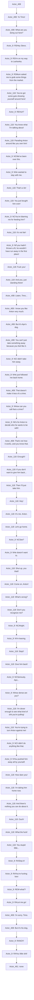

# ATOPIA/Crossroads

```mermaid
graph TD
    93_0["Actor_408"]
    93_1["Actor_408: Yo Timo!"]
    93_2["Actor_408: What are you doing out here?"]
    93_3["Actor_9: RSHey Stevo."]
    93_4["Actor_9: RSI'm on my way to Lashanka."]
    93_5["Actor_9: RSMum asked me to grab some things from the market."]
    93_6["Actor_118: You've got some guts showing yourself around here!"]
    93_7["Actor_9: REHuh?"]
    93_8["Actor_118: You know what I'm talking about!"]
    93_9["Actor_118: Parading Anton around like you own him!"]
    93_10["Actor_9: NCWe've been over this."]
    93_11["Actor_9: NHe wanted to stay with me."]
    93_12["Actor_118: That's a lie!"]
    93_13["Actor_118: You just bought him over!"]
    93_14["Actor_9: NCYou're blaming me for feeding him?"]
    93_15["Actor_118: It's not fair!"]
    93_16["Actor_9: NIf you hadn't thrown a fit, he wouldn't have run away in the first place!"]
    93_17["Actor_118: Fuck you!"]
    93_18["Actor_118: And you, just standing there!"]
    93_19["Actor_408: Listen, Timo..."]
    93_20["Actor_408: I know you like Anton very much."]
    93_21["Actor_408: But it's Apo's dog."]
    93_22["Actor_408: You can't just take something away because you feel like it."]
    93_23["Actor_9: NCI didn't take him away."]
    93_24["Actor_9: NHe just followed me back home."]
    93_25["Actor_408: That doesn't make it less of a crime."]
    93_26["Actor_9: NHow can you call that a crime?"]
    93_27["Actor_9: NIt's for Anton to decide who he wants to be with!"]
    93_28["Actor_408: That's not how it works, and you know that."]
    93_29["Actor_118: Enough!!"]
    93_30["Actor_118: If you don't want to give him back..."]
    93_31["Actor_118: Then I'll just take him."]
    93_32["Actor_118: Hey!"]
    93_33["Actor_118: It's me, Anton."]
    93_34["Actor_118: Let's go home."]
    93_35["Actor_9: NCSee?"]
    93_36["Actor_9: NHe doesn't want to."]
    93_37["Actor_118: Shut up, you thief!"]
    93_38["Actor_118: Come on, Anton!"]
    93_39["Actor_118: What's wrong?"]
    93_40["Actor_118: Don't you recognize me?"]
    93_41["Actor_9: NCAlright."]
    93_42["Actor_9: NI'm leaving."]
    93_43["Actor_118: Stop!!"]
    93_44["Actor_118: Give him back!"]
    93_45["Actor_9: NCSeriously, Apo..."]
    93_46["Actor_9: NHow dense are you?"]
    93_47["Actor_118: I'm clever enough to see what kind of shit you're pulling!"]
    93_48["Actor_118: You're trying to turn Anton against me!"]
    93_49["Actor_9: NCI didn't do anything like that."]
    93_50["Actor_9: NYou pushed him away all by yourself."]
    93_51["Actor_118: How dare you!"]
    93_52["Actor_118: I'm taking him home now."]
    93_53["Actor_118: And there's nothing you can do about it."]
    93_54["Actor_118: Ouch!"]
    93_55["Actor_118: What the fuck!"]
    93_56["Actor_118: You stupid little..."]
    93_57["Actor_9: RAStop it!"]
    93_58["Actor_9: RAYou're hurting him!"]
    93_59["Actor_9: REW-what?!"]
    93_60["Actor_9: RALet me go!"]
    93_61["Actor_408: I'm sorry, Timo."]
    93_62["Actor_408: But it's his dog."]
    93_63["Actor_9: RANO!!!"]
    93_64["Actor_9: RAYou little shit!"]
    93_65["Actor_461: none"]
    93_0 --> 93_1
    93_1 --> 93_2
    93_2 --> 93_3
    93_3 --> 93_4
    93_4 --> 93_5
    93_5 --> 93_6
    93_6 --> 93_7
    93_7 --> 93_8
    93_8 --> 93_9
    93_9 --> 93_10
    93_10 --> 93_11
    93_11 --> 93_12
    93_12 --> 93_13
    93_13 --> 93_14
    93_14 --> 93_15
    93_15 --> 93_16
    93_16 --> 93_17
    93_17 --> 93_18
    93_18 --> 93_19
    93_19 --> 93_20
    93_20 --> 93_21
    93_21 --> 93_22
    93_22 --> 93_23
    93_23 --> 93_24
    93_24 --> 93_25
    93_25 --> 93_26
    93_26 --> 93_27
    93_27 --> 93_28
    93_28 --> 93_29
    93_29 --> 93_30
    93_30 --> 93_31
    93_31 --> 93_32
    93_32 --> 93_33
    93_33 --> 93_34
    93_34 --> 93_35
    93_35 --> 93_36
    93_36 --> 93_37
    93_37 --> 93_38
    93_38 --> 93_39
    93_39 --> 93_40
    93_40 --> 93_41
    93_41 --> 93_42
    93_42 --> 93_43
    93_43 --> 93_44
    93_44 --> 93_45
    93_45 --> 93_46
    93_46 --> 93_47
    93_47 --> 93_48
    93_48 --> 93_49
    93_49 --> 93_50
    93_50 --> 93_51
    93_51 --> 93_52
    93_52 --> 93_53
    93_53 --> 93_54
    93_54 --> 93_55
    93_55 --> 93_56
    93_56 --> 93_57
    93_57 --> 93_58
    93_58 --> 93_59
    93_59 --> 93_60
    93_60 --> 93_61
    93_61 --> 93_62
    93_62 --> 93_63
    93_63 --> 93_64
    93_64 --> 93_65
```