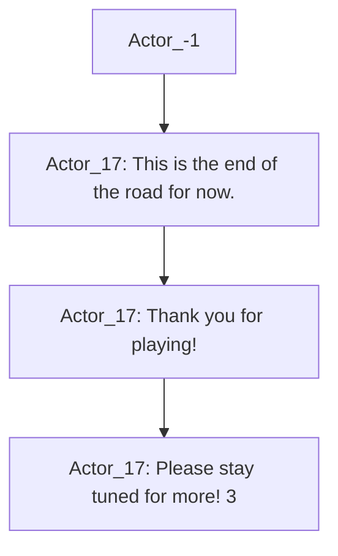

# ATOPIA/Dummy

```mermaid
graph TD
    91_0["Actor_-1"]
    91_1["Actor_17: This is the end of the road for now."]
    91_2["Actor_17: Thank you for playing!"]
    91_3["Actor_17: Please stay tuned for more! 3"]
    91_0 --> 91_1
    91_1 --> 91_2
    91_2 --> 91_3
```