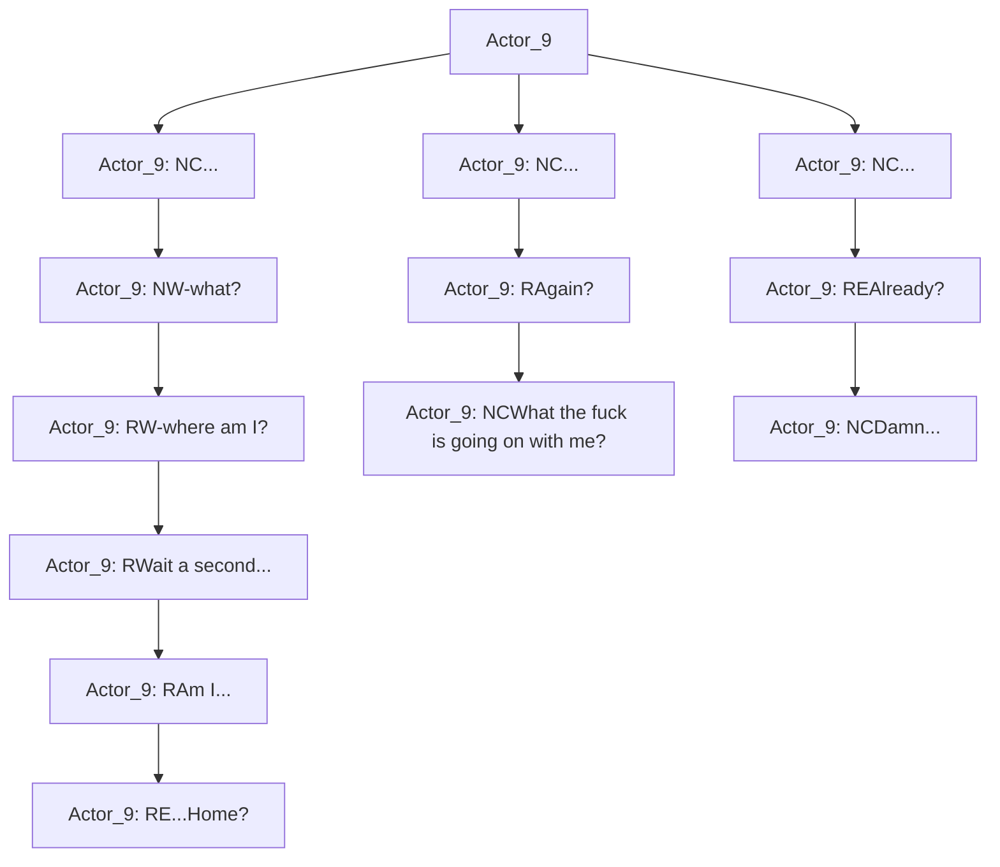

# ATOPIA/eiro/EV001

```mermaid
graph TD
    96_0["Actor_9"]
    96_1["Actor_9: NC..."]
    96_2["Actor_9: NW-what?"]
    96_3["Actor_9: RW-where am I?"]
    96_4["Actor_9: RWait a second..."]
    96_5["Actor_9: RAm I..."]
    96_6["Actor_9: RE...Home?"]
    96_7["Actor_9: NC..."]
    96_8["Actor_9: RAgain?"]
    96_9["Actor_9: NCWhat the fuck is going on with me?"]
    96_10["Actor_9: NC..."]
    96_11["Actor_9: REAlready?"]
    96_12["Actor_9: NCDamn..."]
    96_0 --> 96_1
    96_0 --> 96_7
    96_0 --> 96_10
    96_1 --> 96_2
    96_2 --> 96_3
    96_3 --> 96_4
    96_4 --> 96_5
    96_5 --> 96_6
    96_7 --> 96_8
    96_8 --> 96_9
    96_10 --> 96_11
    96_11 --> 96_12
```