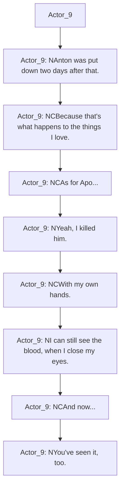

# ATOPIA/eiro/EV004

```mermaid
graph TD
    97_0["Actor_9"]
    97_1["Actor_9: NAnton was put down two days after that."]
    97_2["Actor_9: NCBecause that's what happens to the things I love."]
    97_3["Actor_9: NCAs for Apo..."]
    97_4["Actor_9: NYeah, I killed him."]
    97_5["Actor_9: NCWith my own hands."]
    97_6["Actor_9: NI can still see the blood, when I close my eyes."]
    97_7["Actor_9: NCAnd now..."]
    97_8["Actor_9: NYou've seen it, too."]
    97_0 --> 97_1
    97_1 --> 97_2
    97_2 --> 97_3
    97_3 --> 97_4
    97_4 --> 97_5
    97_5 --> 97_6
    97_6 --> 97_7
    97_7 --> 97_8
```