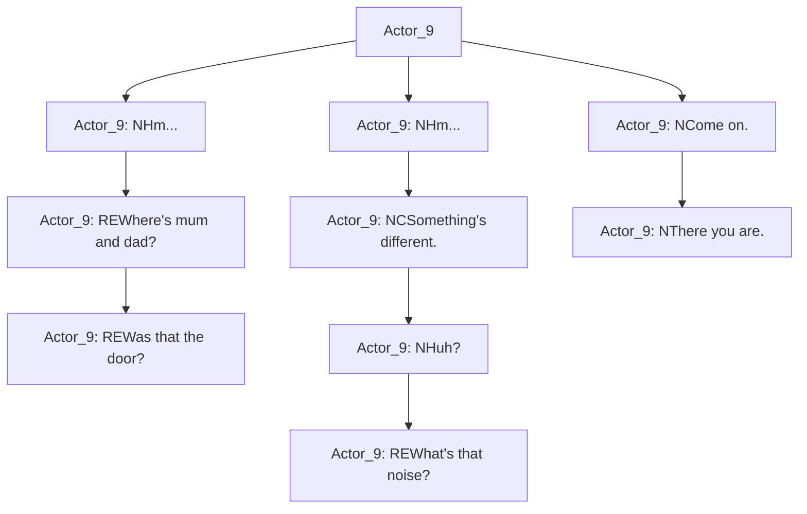

# ATOPIA/eiro/eiro 1

```mermaid
graph TD
    94_0["Actor_9"]
    94_1["Actor_9: NHm..."]
    94_2["Actor_9: REWhere's mum and dad?"]
    94_3["Actor_9: REWas that the door?"]
    94_4["Actor_9: NHm..."]
    94_5["Actor_9: NCSomething's different."]
    94_6["Actor_9: NHuh?"]
    94_7["Actor_9: REWhat's that noise?"]
    94_8["Actor_9: NCome on."]
    94_9["Actor_9: NThere you are."]
    94_0 --> 94_1
    94_0 --> 94_4
    94_0 --> 94_8
    94_1 --> 94_2
    94_2 --> 94_3
    94_4 --> 94_5
    94_5 --> 94_6
    94_6 --> 94_7
    94_8 --> 94_9
```