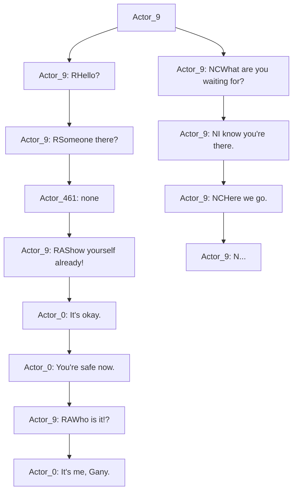

# ATOPIA/eiro/eiro 2

```mermaid
graph TD
    95_0["Actor_9"]
    95_1["Actor_9: RHello?"]
    95_2["Actor_9: RSomeone there?"]
    95_3["Actor_461: none"]
    95_4["Actor_9: RAShow yourself already!"]
    95_5["Actor_0: It's okay."]
    95_6["Actor_0: You're safe now."]
    95_7["Actor_9: RAWho is it!?"]
    95_8["Actor_0: It's me, Gany."]
    95_9["Actor_9: NCWhat are you waiting for?"]
    95_10["Actor_9: NI know you're there."]
    95_11["Actor_9: NCHere we go."]
    95_12["Actor_9: N..."]
    95_0 --> 95_1
    95_0 --> 95_9
    95_1 --> 95_2
    95_2 --> 95_3
    95_3 --> 95_4
    95_4 --> 95_5
    95_5 --> 95_6
    95_6 --> 95_7
    95_7 --> 95_8
    95_9 --> 95_10
    95_10 --> 95_11
    95_11 --> 95_12
```