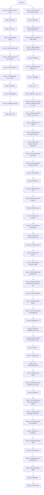

# Amryn/Chicken House/EV004

```mermaid
graph TD
    98_0["Actor_4"]
    98_1["Actor_4: SYou're the new guy?"]
    98_2["Actor_9: SSYep."]
    98_3["Actor_4: SCHm..."]
    98_4["Actor_9: NPSomething wrong?"]
    98_5["Actor_4: SHow old are you?"]
    98_6["Actor_9: SCThat's none of your business."]
    98_7["Actor_4: SSCIs that so?"]
    98_8["Actor_4: SSGanymede, was it, right?"]
    98_9["Actor_9: SCMhm."]
    98_10["Actor_4: SSCAlright."]
    98_11["Actor_4: SSI think you'll do."]
    98_12["Actor_461: none"]
    98_13["Actor_4: SYou think you can convince them?"]
    98_14["Actor_9: SSYeah."]
    98_15["Actor_9: NGI've been to places likes this one."]
    98_16["Actor_9: NGCAll it needs is a little nudge."]
    98_17["Actor_4: SWe're talking about real people, here."]
    98_18["Actor_9: SSI know."]
    98_19["Actor_9: NGCThat's what makes it fun."]
    98_20["Actor_9: RGRight?"]
    98_21["Actor_4: SC..."]
    98_22["Actor_9: RGCOh, come on!"]
    98_23["Actor_9: NGCYou're in this business, whether you like it, or not."]
    98_24["Actor_9: SCAnd if we don't make a move, soon..."]
    98_25["Actor_9: SWe'll lose our chance."]
    98_26["Actor_4: SDoesn't mean you have to enjoy it."]
    98_27["Actor_9: SBut it also doesn't make any difference."]
    98_28["Actor_9: SCYou think that guy, Forten..."]
    98_29["Actor_9: SCares whether we grit our teeth?"]
    98_30["Actor_9: SCI wouldn't."]
    98_31["Actor_9: NCFace it."]
    98_32["Actor_9: NWe're good at this."]
    98_33["Actor_9: SSIt's what we're made for."]
    98_34["Actor_9: NCLife is war."]
    98_35["Actor_9: NAnd we're survivors."]
    98_36["Actor_9: NCJust like our dear general."]
    98_37["Actor_4: SCI'm not concerned about him."]
    98_38["Actor_9: SCYeah, I get it."]
    98_39["Actor_9: SThese poor people..."]
    98_40["Actor_9: SCThey don't deserve it, right?"]
    98_41["Actor_9: NPCGranted, they probably don't."]
    98_42["Actor_9: SCBut they've put themselves in the line of fire."]
    98_43["Actor_9: SThey're fanatics."]
    98_44["Actor_9: NCAnd all we're doing..."]
    98_45["Actor_9: NIs to offer a bit of encouragement."]
    98_46["Actor_9: SCMy point is..."]
    98_47["Actor_9: NCThis is happening, either way."]
    98_48["Actor_9: RGSo we might as well enjoy the ride."]
    98_49["Actor_4: SCHm..."]
    98_50["Actor_4: SI gotta say..."]
    98_51["Actor_4: SSI underestimated you."]
    98_52["Actor_9: SGCJoin the queue."]
    98_53["Actor_4: SSCBut there's a question on my mind."]
    98_54["Actor_9: SSHit me."]
    98_55["Actor_4: SCYou like to put that innocent little act upfront."]
    98_56["Actor_4: SCSo what I'm speaking to right now..."]
    98_57["Actor_4: SIs your second line of defense."]
    98_58["Actor_4: SSCNow, I'm wondering..."]
    98_59["Actor_4: SGWhat's beyond that?"]
    98_60["Actor_4: SSCSo tell me..."]
    98_61["Actor_4: SSWhat's the real Ganymede like?"]
    98_62["Actor_9: RGCThat angle, really?"]
    98_63["Actor_9: NGCOkay..."]
    98_64["Actor_9: RGYou'll do."]
    98_0 --> 98_1
    98_0 --> 98_13
    98_1 --> 98_2
    98_2 --> 98_3
    98_3 --> 98_4
    98_4 --> 98_5
    98_5 --> 98_6
    98_6 --> 98_7
    98_7 --> 98_8
    98_8 --> 98_9
    98_9 --> 98_10
    98_10 --> 98_11
    98_11 --> 98_12
    98_13 --> 98_14
    98_14 --> 98_15
    98_15 --> 98_16
    98_16 --> 98_17
    98_17 --> 98_18
    98_18 --> 98_19
    98_19 --> 98_20
    98_20 --> 98_21
    98_21 --> 98_22
    98_22 --> 98_23
    98_23 --> 98_24
    98_24 --> 98_25
    98_25 --> 98_26
    98_26 --> 98_27
    98_27 --> 98_28
    98_28 --> 98_29
    98_29 --> 98_30
    98_30 --> 98_31
    98_31 --> 98_32
    98_32 --> 98_33
    98_33 --> 98_34
    98_34 --> 98_35
    98_35 --> 98_36
    98_36 --> 98_37
    98_37 --> 98_38
    98_38 --> 98_39
    98_39 --> 98_40
    98_40 --> 98_41
    98_41 --> 98_42
    98_42 --> 98_43
    98_43 --> 98_44
    98_44 --> 98_45
    98_45 --> 98_46
    98_46 --> 98_47
    98_47 --> 98_48
    98_48 --> 98_49
    98_49 --> 98_50
    98_50 --> 98_51
    98_51 --> 98_52
    98_52 --> 98_53
    98_53 --> 98_54
    98_54 --> 98_55
    98_55 --> 98_56
    98_56 --> 98_57
    98_57 --> 98_58
    98_58 --> 98_59
    98_59 --> 98_60
    98_60 --> 98_61
    98_61 --> 98_62
    98_62 --> 98_63
    98_63 --> 98_64
```