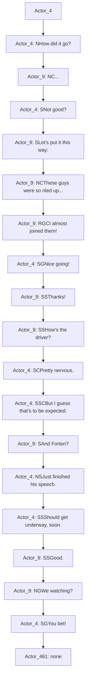

# Amryn/Chicken House/Gany

```mermaid
graph TD
    99_0["Actor_4"]
    99_1["Actor_4: NHow did it go?"]
    99_2["Actor_9: NC..."]
    99_3["Actor_4: SNot good?"]
    99_4["Actor_9: SLet's put it this way:"]
    99_5["Actor_9: NCThese guys were so riled up..."]
    99_6["Actor_9: RGCI almost joined them!"]
    99_7["Actor_4: SGNice going!"]
    99_8["Actor_9: SSThanks!"]
    99_9["Actor_9: SSHow's the driver?"]
    99_10["Actor_4: SCPretty nervous."]
    99_11["Actor_4: SSCBut I guess that's to be expected."]
    99_12["Actor_9: SAnd Forten?"]
    99_13["Actor_4: NSJust finished his speech."]
    99_14["Actor_4: SSShould get underway, soon."]
    99_15["Actor_9: SSGood."]
    99_16["Actor_9: NGWe watching?"]
    99_17["Actor_4: SGYou bet!"]
    99_18["Actor_461: none"]
    99_0 --> 99_1
    99_1 --> 99_2
    99_2 --> 99_3
    99_3 --> 99_4
    99_4 --> 99_5
    99_5 --> 99_6
    99_6 --> 99_7
    99_7 --> 99_8
    99_8 --> 99_9
    99_9 --> 99_10
    99_10 --> 99_11
    99_11 --> 99_12
    99_12 --> 99_13
    99_13 --> 99_14
    99_14 --> 99_15
    99_15 --> 99_16
    99_16 --> 99_17
    99_17 --> 99_18
```