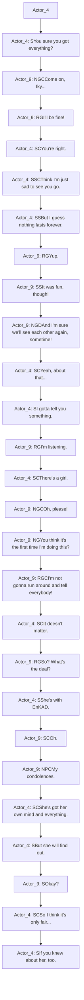

# Amryn/Chicken House/Icarus

```mermaid
graph TD
    100_0["Actor_4"]
    100_1["Actor_4: SYou sure you got everything?"]
    100_2["Actor_9: NGCCome on, Iky..."]
    100_3["Actor_9: RGI'll be fine!"]
    100_4["Actor_4: SCYou're right."]
    100_5["Actor_4: SSCThink I'm just sad to see you go."]
    100_6["Actor_4: SSBut I guess nothing lasts forever."]
    100_7["Actor_9: RGYup."]
    100_8["Actor_9: SSIt was fun, though!"]
    100_9["Actor_9: NGDAnd I'm sure we'll see each other again, sometime!"]
    100_10["Actor_4: SCYeah, about that..."]
    100_11["Actor_4: SI gotta tell you something."]
    100_12["Actor_9: RGI'm listening."]
    100_13["Actor_4: SCThere's a girl."]
    100_14["Actor_9: NGCOh, please!"]
    100_15["Actor_9: NGYou think it's the first time I'm doing this?"]
    100_16["Actor_9: RGCI'm not gonna run around and tell everybody!"]
    100_17["Actor_4: SCIt doesn't matter."]
    100_18["Actor_9: RGSo? What's the deal?"]
    100_19["Actor_4: SShe's with EnKAD."]
    100_20["Actor_9: SCOh."]
    100_21["Actor_9: NPCMy condolences."]
    100_22["Actor_4: SCShe's got her own mind and everything."]
    100_23["Actor_4: SBut she will find out."]
    100_24["Actor_9: SOkay?"]
    100_25["Actor_4: SCSo I think it's only fair..."]
    100_26["Actor_4: SIf you knew about her, too."]
    100_0 --> 100_1
    100_1 --> 100_2
    100_2 --> 100_3
    100_3 --> 100_4
    100_4 --> 100_5
    100_5 --> 100_6
    100_6 --> 100_7
    100_7 --> 100_8
    100_8 --> 100_9
    100_9 --> 100_10
    100_10 --> 100_11
    100_11 --> 100_12
    100_12 --> 100_13
    100_13 --> 100_14
    100_14 --> 100_15
    100_15 --> 100_16
    100_16 --> 100_17
    100_17 --> 100_18
    100_18 --> 100_19
    100_19 --> 100_20
    100_20 --> 100_21
    100_21 --> 100_22
    100_22 --> 100_23
    100_23 --> 100_24
    100_24 --> 100_25
    100_25 --> 100_26
```