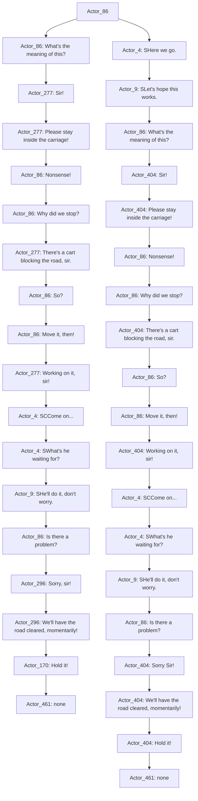

# Amryn/Durring Road/Assassinator

```mermaid
graph TD
    101_0["Actor_86"]
    101_1["Actor_86: What's the meaning of this?"]
    101_2["Actor_277: Sir!"]
    101_3["Actor_277: Please stay inside the carriage!"]
    101_4["Actor_86: Nonsense!"]
    101_5["Actor_86: Why did we stop?"]
    101_6["Actor_277: There's a cart blocking the road, sir."]
    101_7["Actor_86: So?"]
    101_8["Actor_86: Move it, then!"]
    101_9["Actor_277: Working on it, sir!"]
    101_10["Actor_4: SCCome on..."]
    101_11["Actor_4: SWhat's he waiting for?"]
    101_12["Actor_9: SHe'll do it, don't worry."]
    101_13["Actor_86: Is there a problem?"]
    101_14["Actor_296: Sorry, sir!"]
    101_15["Actor_296: We'll have the road cleared, momentarily!"]
    101_16["Actor_170: Hold it!"]
    101_17["Actor_461: none"]
    101_18["Actor_4: SHere we go."]
    101_19["Actor_9: SLet's hope this works."]
    101_20["Actor_86: What's the meaning of this?"]
    101_21["Actor_404: Sir!"]
    101_22["Actor_404: Please stay inside the carriage!"]
    101_23["Actor_86: Nonsense!"]
    101_24["Actor_86: Why did we stop?"]
    101_25["Actor_404: There's a cart blocking the road, sir."]
    101_26["Actor_86: So?"]
    101_27["Actor_86: Move it, then!"]
    101_28["Actor_404: Working on it, sir!"]
    101_29["Actor_4: SCCome on..."]
    101_30["Actor_4: SWhat's he waiting for?"]
    101_31["Actor_9: SHe'll do it, don't worry."]
    101_32["Actor_86: Is there a problem?"]
    101_33["Actor_404: Sorry Sir!"]
    101_34["Actor_404: We'll have the road cleared, momentarily!"]
    101_35["Actor_404: Hold it!"]
    101_36["Actor_461: none"]
    101_0 --> 101_1
    101_0 --> 101_18
    101_1 --> 101_2
    101_2 --> 101_3
    101_3 --> 101_4
    101_4 --> 101_5
    101_5 --> 101_6
    101_6 --> 101_7
    101_7 --> 101_8
    101_8 --> 101_9
    101_9 --> 101_10
    101_10 --> 101_11
    101_11 --> 101_12
    101_12 --> 101_13
    101_13 --> 101_14
    101_14 --> 101_15
    101_15 --> 101_16
    101_16 --> 101_17
    101_18 --> 101_19
    101_19 --> 101_20
    101_20 --> 101_21
    101_21 --> 101_22
    101_22 --> 101_23
    101_23 --> 101_24
    101_24 --> 101_25
    101_25 --> 101_26
    101_26 --> 101_27
    101_27 --> 101_28
    101_28 --> 101_29
    101_29 --> 101_30
    101_30 --> 101_31
    101_31 --> 101_32
    101_32 --> 101_33
    101_33 --> 101_34
    101_34 --> 101_35
    101_35 --> 101_36
```