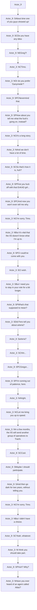

# Amryn/Dusa/EV001

```mermaid
graph TD
    102_0["Actor_9"]
    102_1["Actor_9: SAbout time one of you guys showed up!"]
    102_2["Actor_9: SCDo you have any idea-"]
    102_3["Actor_9: NEGreg?!"]
    102_4["Actor_3: NCTimo."]
    102_5["Actor_3: NOr do you prefer 'Ganymede'?"]
    102_6["Actor_9: SPCNevermind that."]
    102_7["Actor_9: SPHow about you tell me what the fuck's going on, instead?"]
    102_8["Actor_3: NCIt's a long story."]
    102_9["Actor_3: NAnd we don't have a lot of time."]
    102_10["Actor_9: SCSo that's how it is, huh?"]
    102_11["Actor_9: SPFirst you fuck off with that EnKAD girl..."]
    102_12["Actor_9: SPCAnd now you won't even tell me why."]
    102_13["Actor_3: NCI'm sorry, Timo."]
    102_14["Actor_3: NBut it's vital that the IIS doesn't know what I'm up to."]
    102_15["Actor_9: SPCI could've come with you."]
    102_16["Actor_3: SCI wish."]
    102_17["Actor_3: SBut I need you to stay in your role for a bit longer."]
    102_18["Actor_9: SPWhat's that supposed to mean?"]
    102_19["Actor_3: SDid Fero tell you about arteria?"]
    102_20["Actor_9: Sarteria?"]
    102_21["Actor_3: SCHm..."]
    102_22["Actor_9: SPCGregor..."]
    102_23["Actor_9: SPI'm running out of patience, here."]
    102_24["Actor_3: NAlright."]
    102_25["Actor_3: NCLet me bring you up to speed."]
    102_26["Actor_3: NIn a few months, the IIS will send another group of operatives to Trachi."]
    102_27["Actor_9: SCCool."]
    102_28["Actor_9: SMaybe I should participate."]
    102_29["Actor_9: SAnd then go dark for two years, without telling you."]
    102_30["Actor_3: NCI'm sorry, Timo."]
    102_31["Actor_3: NBut I didn't have a choice."]
    102_32["Actor_9: SCYeah, whatever."]
    102_33["Actor_3: NI think you should take part."]
    102_34["Actor_9: SPHuh? Why?"]
    102_35["Actor_3: NHave you ever heard of an agent called Atlas?"]
    102_0 --> 102_1
    102_1 --> 102_2
    102_2 --> 102_3
    102_3 --> 102_4
    102_4 --> 102_5
    102_5 --> 102_6
    102_6 --> 102_7
    102_7 --> 102_8
    102_8 --> 102_9
    102_9 --> 102_10
    102_10 --> 102_11
    102_11 --> 102_12
    102_12 --> 102_13
    102_13 --> 102_14
    102_14 --> 102_15
    102_15 --> 102_16
    102_16 --> 102_17
    102_17 --> 102_18
    102_18 --> 102_19
    102_19 --> 102_20
    102_20 --> 102_21
    102_21 --> 102_22
    102_22 --> 102_23
    102_23 --> 102_24
    102_24 --> 102_25
    102_25 --> 102_26
    102_26 --> 102_27
    102_27 --> 102_28
    102_28 --> 102_29
    102_29 --> 102_30
    102_30 --> 102_31
    102_31 --> 102_32
    102_32 --> 102_33
    102_33 --> 102_34
    102_34 --> 102_35
```