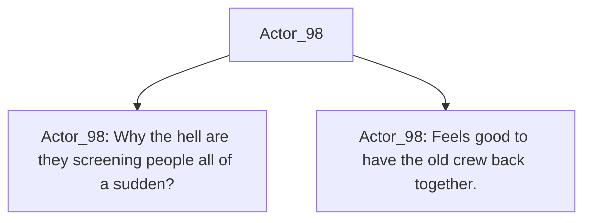

# Characters/Abel

```mermaid
graph TD
    104_0["Actor_98"]
    104_1["Actor_98: Why the hell are they screening people all of a sudden?"]
    104_2["Actor_98: Feels good to have the old crew back together."]
    104_0 --> 104_1
    104_0 --> 104_2
```