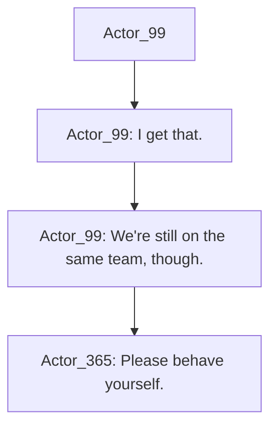

# Characters/Adam

```mermaid
graph TD
    105_0["Actor_99"]
    105_1["Actor_99: I get that."]
    105_2["Actor_99: We're still on the same team, though."]
    105_3["Actor_365: Please behave yourself."]
    105_0 --> 105_1
    105_1 --> 105_2
    105_2 --> 105_3
```