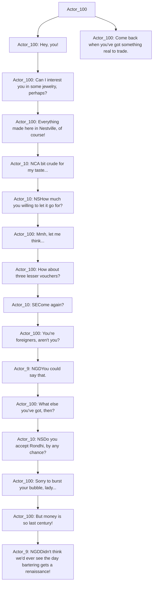

# Characters/Agata

```mermaid
graph TD
    106_0["Actor_100"]
    106_1["Actor_100: Hey, you!"]
    106_2["Actor_100: Can I interest you in some jewelry, perhaps?"]
    106_3["Actor_100: Everything made here in Nestville, of course!"]
    106_4["Actor_10: NCA bit crude for my taste..."]
    106_5["Actor_10: NSHow much you willing to let it go for?"]
    106_6["Actor_100: Mmh, let me think..."]
    106_7["Actor_100: How about three lesser vouchers?"]
    106_8["Actor_10: SECome again?"]
    106_9["Actor_100: You're foreigners, aren't you?"]
    106_10["Actor_9: NGDYou could say that."]
    106_11["Actor_100: What else you've got, then?"]
    106_12["Actor_10: NSDo you accept Rondhi, by any chance?"]
    106_13["Actor_100: Sorry to burst your bubble, lady..."]
    106_14["Actor_100: But money is so last century!"]
    106_15["Actor_9: NGDDidn't think we'd ever see the day bartering gets a renaissance!"]
    106_16["Actor_100: Come back when you've got something real to trade."]
    106_0 --> 106_1
    106_0 --> 106_16
    106_1 --> 106_2
    106_2 --> 106_3
    106_3 --> 106_4
    106_4 --> 106_5
    106_5 --> 106_6
    106_6 --> 106_7
    106_7 --> 106_8
    106_8 --> 106_9
    106_9 --> 106_10
    106_10 --> 106_11
    106_11 --> 106_12
    106_12 --> 106_13
    106_13 --> 106_14
    106_14 --> 106_15
```