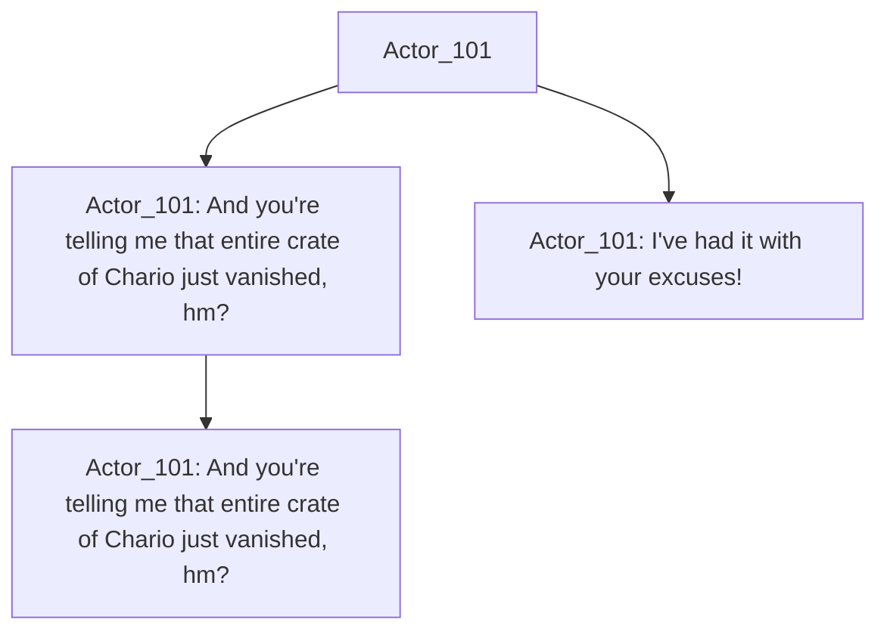

# Characters/Ainsley

```mermaid
graph TD
    107_0["Actor_101"]
    107_1["Actor_101: And you're telling me that entire crate of Chario just vanished, hm?"]
    107_2["Actor_101: And you're telling me that entire crate of Chario just vanished, hm?"]
    107_3["Actor_101: I've had it with your excuses!"]
    107_0 --> 107_1
    107_0 --> 107_3
    107_1 --> 107_2
```