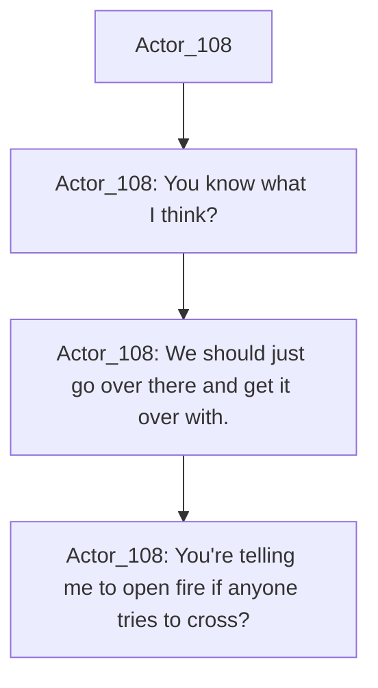

# Characters/Aleš

```mermaid
graph TD
    114_0["Actor_108"]
    114_1["Actor_108: You know what I think?"]
    114_2["Actor_108: We should just go over there and get it over with."]
    114_3["Actor_108: You're telling me to open fire if anyone tries to cross?"]
    114_0 --> 114_1
    114_1 --> 114_2
    114_2 --> 114_3
```