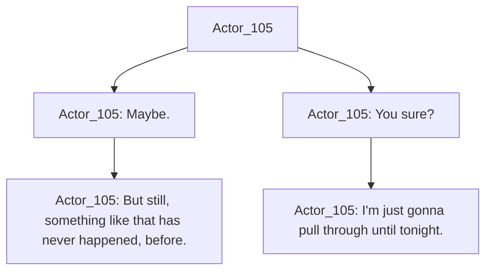

# Characters/Aleksander

```mermaid
graph TD
    111_0["Actor_105"]
    111_1["Actor_105: Maybe."]
    111_2["Actor_105: But still, something like that has never happened, before."]
    111_3["Actor_105: You sure?"]
    111_4["Actor_105: I'm just gonna pull through until tonight."]
    111_0 --> 111_1
    111_0 --> 111_3
    111_1 --> 111_2
    111_3 --> 111_4
```