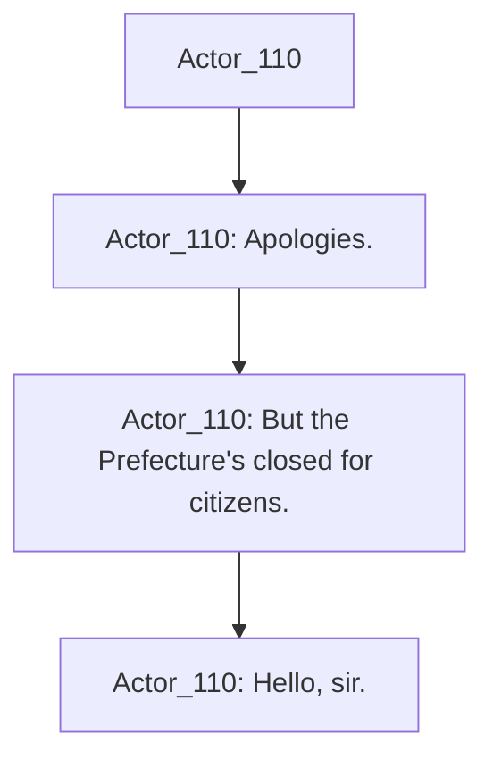

# Characters/Alonzo

```mermaid
graph TD
    116_0["Actor_110"]
    116_1["Actor_110: Apologies."]
    116_2["Actor_110: But the Prefecture's closed for citizens."]
    116_3["Actor_110: Hello, sir."]
    116_0 --> 116_1
    116_1 --> 116_2
    116_2 --> 116_3
```