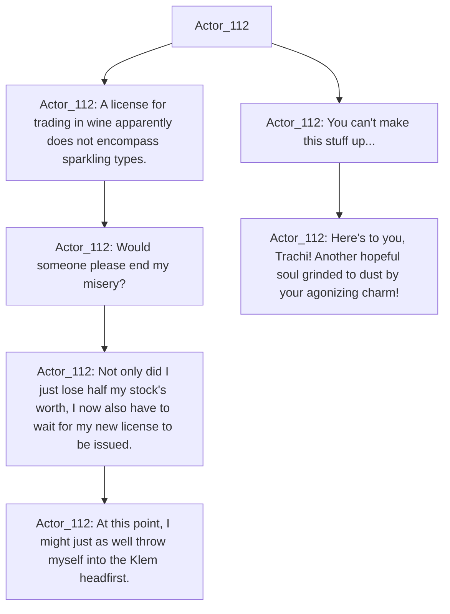

# Characters/Andrej

```mermaid
graph TD
    117_0["Actor_112"]
    117_1["Actor_112: A license for trading in wine apparently does not encompass sparkling types."]
    117_2["Actor_112: Would someone please end my misery?"]
    117_3["Actor_112: Not only did I just lose half my stock's worth, I now also have to wait for my new license to be issued."]
    117_4["Actor_112: At this point, I might just as well throw myself into the Klem headfirst."]
    117_5["Actor_112: You can't make this stuff up..."]
    117_6["Actor_112: Here's to you, Trachi! Another hopeful soul grinded to dust by your agonizing charm!"]
    117_0 --> 117_1
    117_0 --> 117_5
    117_1 --> 117_2
    117_2 --> 117_3
    117_3 --> 117_4
    117_5 --> 117_6
```