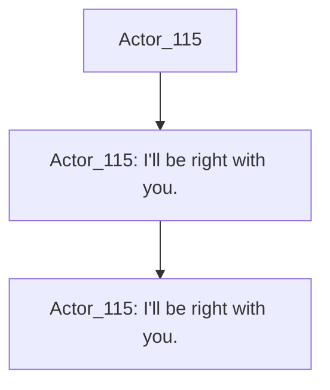

# Characters/Anita

```mermaid
graph TD
    120_0["Actor_115"]
    120_1["Actor_115: I'll be right with you."]
    120_2["Actor_115: I'll be right with you."]
    120_0 --> 120_1
    120_1 --> 120_2
```