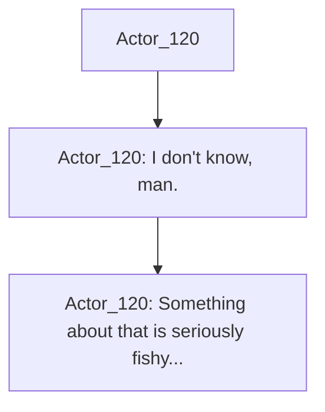

# Characters/Ardian

```mermaid
graph TD
    124_0["Actor_120"]
    124_1["Actor_120: I don't know, man."]
    124_2["Actor_120: Something about that is seriously fishy..."]
    124_0 --> 124_1
    124_1 --> 124_2
```