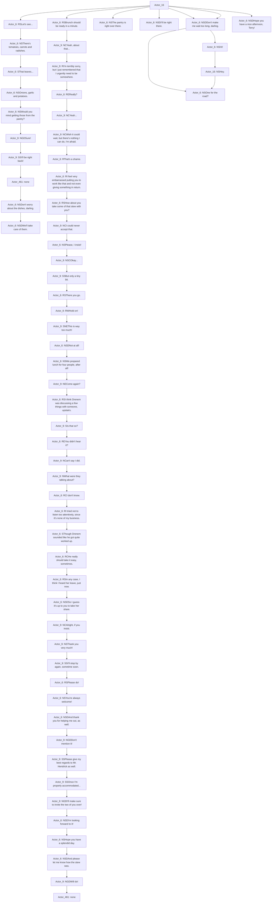

# Characters/Ariadne

```mermaid
graph TD
    27_0["Actor_16"]
    27_1["Actor_6"]
    27_1["Actor_6: NSDDon't make me wait too long, darling."]
    27_2["Actor_6: RSLet's see..."]
    27_3["Actor_6: NSThere's tomatoes, carrots and radishes."]
    27_4["Actor_6: SThat leaves..."]
    27_5["Actor_6: NSOnions, garlic and potatoes."]
    27_6["Actor_6: NSWould you mind getting those from the pantry?"]
    27_7["Actor_9: NGDSure!"]
    27_8["Actor_9: SSI'll be right back!"]
    27_9["Actor_461: none"]
    27_10["Actor_6: NSDon't worry about the dishes, darling."]
    27_11["Actor_6: NSDWe'll take care of them."]
    27_12["Actor_6: NSThe pantry is right over there."]
    27_13["Actor_6: NSDI'll be right there."]
    27_14["Actor_6: RSBrunch should be ready in a minute."]
    27_15["Actor_9: NCYeah, about that..."]
    27_16["Actor_9: RI'm terribly sorry, but I just remembered that I urgently need to be somewhere."]
    27_17["Actor_6: REReally?"]
    27_18["Actor_9: NCYeah..."]
    27_19["Actor_9: NCWish it could wait, but there's nothing I can do, I'm afraid."]
    27_20["Actor_6: RThat's a shame."]
    27_21["Actor_6: RI feel very embarrassed putting you to work like that and not even giving something in return."]
    27_22["Actor_6: RSHow about you take some of that stew with you?"]
    27_23["Actor_9: NCI could never accept that."]
    27_24["Actor_6: NSPlease, I insist!"]
    27_25["Actor_9: NSCOkay..."]
    27_26["Actor_9: SSBut only a tiny bit."]
    27_27["Actor_6: RSThere you go."]
    27_28["Actor_9: RWHold on!"]
    27_29["Actor_9: SNEThis is way too much!"]
    27_30["Actor_6: NSDNot at all!"]
    27_31["Actor_6: NSWe prepared lunch for four people, after all!"]
    27_32["Actor_9: NECome again?"]
    27_33["Actor_6: RSI think Drenem was discussing a few things with someone, upstairs."]
    27_34["Actor_9: SIs that so?"]
    27_35["Actor_6: REYou didn't hear it?"]
    27_36["Actor_9: NCan't say I did."]
    27_37["Actor_9: NWhat were they talking about?"]
    27_38["Actor_6: RCI don't know."]
    27_39["Actor_6: RI tried not to listen too attentively, since it's none of my business."]
    27_40["Actor_6: SThough Drenem sounded like he got quite worked up."]
    27_41["Actor_6: RCHe really should take it easy, sometimes."]
    27_42["Actor_6: RSIn any case, I think I heard her leave, just now."]
    27_43["Actor_6: NSDSo I guess it's up to you to take her share."]
    27_44["Actor_9: NCAlright, if you insist."]
    27_45["Actor_9: NSThank you very much!"]
    27_46["Actor_9: SSI'll stop by again, sometime soon."]
    27_47["Actor_6: RSPlease do!"]
    27_48["Actor_6: NSYou're always welcome!"]
    27_49["Actor_6: NSDAnd thank you for helping me out, as well."]
    27_50["Actor_9: NGDDon't mention it!"]
    27_51["Actor_9: SSPlease give my best regards to Mr. Hendrick as well."]
    27_52["Actor_9: SSOnce I'm properly accommodated..."]
    27_53["Actor_9: NGDI'll make sure to invite the two of you over!"]
    27_54["Actor_6: NSDI'm looking forward to it!"]
    27_55["Actor_6: NSHope you have a splendid day."]
    27_56["Actor_6: NSDAnd please let me know how the stew was."]
    27_57["Actor_9: NGDWill do!"]
    27_58["Actor_461: none"]
    27_59["Actor_6: NSDHope you have a nice afternoon, Terry!"]
    27_167["Actor_6: NSHi!"]
    27_174["Actor_16: NSHey."]
    27_175["Actor_6: NSOne for the road?"]
    27_0 --> 27_1
    27_0 --> 27_1
    27_0 --> 27_2
    27_0 --> 27_12
    27_0 --> 27_13
    27_0 --> 27_14
    27_0 --> 27_59
    27_1 --> 27_167
    27_1 --> 27_175
    27_2 --> 27_3
    27_3 --> 27_4
    27_4 --> 27_5
    27_5 --> 27_6
    27_6 --> 27_7
    27_7 --> 27_8
    27_8 --> 27_9
    27_9 --> 27_10
    27_10 --> 27_11
    27_14 --> 27_15
    27_15 --> 27_16
    27_16 --> 27_17
    27_17 --> 27_18
    27_18 --> 27_19
    27_19 --> 27_20
    27_20 --> 27_21
    27_21 --> 27_22
    27_22 --> 27_23
    27_23 --> 27_24
    27_24 --> 27_25
    27_25 --> 27_26
    27_26 --> 27_27
    27_27 --> 27_28
    27_28 --> 27_29
    27_29 --> 27_30
    27_30 --> 27_31
    27_31 --> 27_32
    27_32 --> 27_33
    27_33 --> 27_34
    27_34 --> 27_35
    27_35 --> 27_36
    27_36 --> 27_37
    27_37 --> 27_38
    27_38 --> 27_39
    27_39 --> 27_40
    27_40 --> 27_41
    27_41 --> 27_42
    27_42 --> 27_43
    27_43 --> 27_44
    27_44 --> 27_45
    27_45 --> 27_46
    27_46 --> 27_47
    27_47 --> 27_48
    27_48 --> 27_49
    27_49 --> 27_50
    27_50 --> 27_51
    27_51 --> 27_52
    27_52 --> 27_53
    27_53 --> 27_54
    27_54 --> 27_55
    27_55 --> 27_56
    27_56 --> 27_57
    27_57 --> 27_58
    27_167 --> 27_174
    27_174 --> 27_175
```