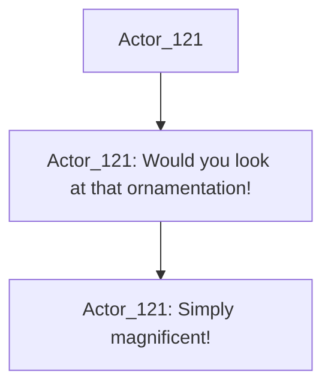

# Characters/Armin

```mermaid
graph TD
    125_0["Actor_121"]
    125_1["Actor_121: Would you look at that ornamentation!"]
    125_2["Actor_121: Simply magnificent!"]
    125_0 --> 125_1
    125_1 --> 125_2
```