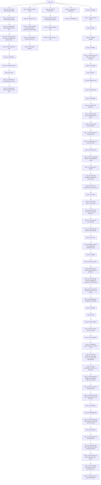

# Characters/Atlas

```mermaid
graph TD
    133_0["Actor_13"]
    133_1["Actor_13: NThis one's been cleared, already."]
    133_2["Actor_13: SThat one has been cleared, already."]
    133_3["Actor_13: NWe should finish our business here, first."]
    133_4["Actor_13: NCI should hurry up, there's no telling when she'll be back."]
    133_5["Actor_13: NIt should be in here."]
    133_6["Actor_13: SCFigures."]
    133_7["Actor_13: SPCThink, Atlas."]
    133_8["Actor_461: none"]
    133_9["Actor_13: NCThere's no point going back in there."]
    133_10["Actor_13: NWe should finish our business here, first."]
    133_11["Actor_13: NCDo yourself a favour."]
    133_12["Actor_13: NDon't rush it."]
    133_13["Actor_13: NThe embassy is in Gharten Street, northwest of Trenton Plaza."]
    133_14["Actor_13: NYou better go before you lose him."]
    133_15["Actor_13: NCWrong entrance."]
    133_16["Actor_13: NCWe're finished here."]
    133_17["Actor_13: NDon't you have somewhere else to be?"]
    133_18["Actor_13: NWe're finished here."]
    133_19["Actor_13: NCI'll see you in hell."]
    133_20["Actor_13: SWe have to keep going."]
    133_21["Actor_13: SCSafehouse."]
    133_22["Actor_13: NCRight."]
    133_23["Actor_13: NYou have the keys?"]
    133_24["Actor_9: NMhm."]
    133_25["Actor_13: NWill he manage?"]
    133_26["Actor_10: NSYup."]
    133_27["Actor_10: NSAs long as his wife is safe, he'll do anything."]
    133_28["Actor_13: NCGood."]
    133_29["Actor_9: NCSo..."]
    133_30["Actor_9: NWhat's next?"]
    133_31["Actor_13: NCWe wait."]
    133_32["Actor_9: NCAlright."]
    133_33["Actor_13: NCBut in the meantime..."]
    133_34["Actor_13: NWe should focus on dealing with two issues."]
    133_35["Actor_13: NCFirst, the Tanner situation."]
    133_36["Actor_13: NCWe know far too litle of him."]
    133_37["Actor_10: NCWhat do you know him, then?"]
    133_38["Actor_13: NCNot much."]
    133_39["Actor_13: NHe's a founding member of the Republican Guard."]
    133_40["Actor_13: NUsed to be a mobster."]
    133_41["Actor_13: NBut Faber managed to mobilize him for his cause."]
    133_42["Actor_9: NAnd so he brought him into the Guard?"]
    133_43["Actor_13: NCYup."]
    133_44["Actor_13: NCHe's his patron, so to speak."]
    133_45["Actor_13: NCOf course, not everyone is happy about that."]
    133_46["Actor_13: NThere's also the 'old Guard'."]
    133_47["Actor_13: NPeople from Amryn's former garrison."]
    133_48["Actor_9: NCI see..."]
    133_49["Actor_9: NNeither of them sound particularly sympathetic to me."]
    133_50["Actor_13: NRight."]
    133_51["Actor_13: NCIn any case..."]
    133_52["Actor_13: NWe have a contact inside the eastern prefecture."]
    133_53["Actor_13: NAnd enough men at his disposal to safeguard our bridgehead."]
    133_54["Actor_13: NCJust in case something goes wrong, of course."]
    133_55["Actor_13: NCRegardless, he agreed to a meeting."]
    133_56["Actor_9: NCOkay."]
    133_57["Actor_9: NSo?"]
    133_58["Actor_13: NIn his office."]
    133_59["Actor_9: NAnd you want one of us, to go?"]
    133_60["Actor_13: NIn his office."]
    133_61["Actor_13: NAnd then there's also Amryn to deal with."]
    133_62["Actor_13: NFor this reason, we've activated one of our assetts in the administration."]
    133_63["Actor_13: NThe administrator of Filmore, to be precise."]
    133_64["Actor_13: NHe's agreed to facilitate a meeting with Faber, this evening."]
    133_65["Actor_13: NAt his house in Filmore Avenue."]
    133_66["Actor_13: NI'll need the two of you to prepare his house for our hit."]
    133_67["Actor_13: NDaphne."]
    133_68["Actor_10: NSRight here!"]
    133_69["Actor_13: NYou'll take care of the upper level, including our man, himself."]
    133_70["Actor_10: NSGot it!"]
    133_71["Actor_13: NGanymede, on the other hand..."]
    133_72["Actor_13: NAt the same time, Ganymede will stake out the ground floor..."]
    133_73["Actor_13: NAnd make sure that his wife won't get in the way."]
    133_74["Actor_13: NShe doesn't know about any of this, according to him..."]
    133_75["Actor_13: NSo try to be on your best behaviour."]
    133_0 --> 133_1
    133_0 --> 133_11
    133_0 --> 133_16
    133_0 --> 133_20
    133_0 --> 133_22
    133_1 --> 133_2
    133_2 --> 133_3
    133_3 --> 133_4
    133_4 --> 133_5
    133_5 --> 133_6
    133_6 --> 133_7
    133_7 --> 133_8
    133_8 --> 133_9
    133_9 --> 133_10
    133_11 --> 133_12
    133_12 --> 133_13
    133_13 --> 133_14
    133_14 --> 133_15
    133_16 --> 133_17
    133_17 --> 133_18
    133_18 --> 133_19
    133_20 --> 133_21
    133_22 --> 133_23
    133_23 --> 133_24
    133_24 --> 133_25
    133_25 --> 133_26
    133_26 --> 133_27
    133_27 --> 133_28
    133_28 --> 133_29
    133_29 --> 133_30
    133_30 --> 133_31
    133_31 --> 133_32
    133_32 --> 133_33
    133_33 --> 133_34
    133_34 --> 133_35
    133_35 --> 133_36
    133_36 --> 133_37
    133_37 --> 133_38
    133_38 --> 133_39
    133_39 --> 133_40
    133_40 --> 133_41
    133_41 --> 133_42
    133_42 --> 133_43
    133_43 --> 133_44
    133_44 --> 133_45
    133_45 --> 133_46
    133_46 --> 133_47
    133_47 --> 133_48
    133_48 --> 133_49
    133_49 --> 133_50
    133_50 --> 133_51
    133_51 --> 133_52
    133_52 --> 133_53
    133_53 --> 133_54
    133_54 --> 133_55
    133_55 --> 133_56
    133_56 --> 133_57
    133_57 --> 133_58
    133_58 --> 133_59
    133_59 --> 133_60
    133_60 --> 133_61
    133_61 --> 133_62
    133_62 --> 133_63
    133_63 --> 133_64
    133_64 --> 133_65
    133_65 --> 133_66
    133_66 --> 133_67
    133_67 --> 133_68
    133_68 --> 133_69
    133_69 --> 133_70
    133_70 --> 133_71
    133_71 --> 133_72
    133_72 --> 133_73
    133_73 --> 133_74
    133_74 --> 133_75
```