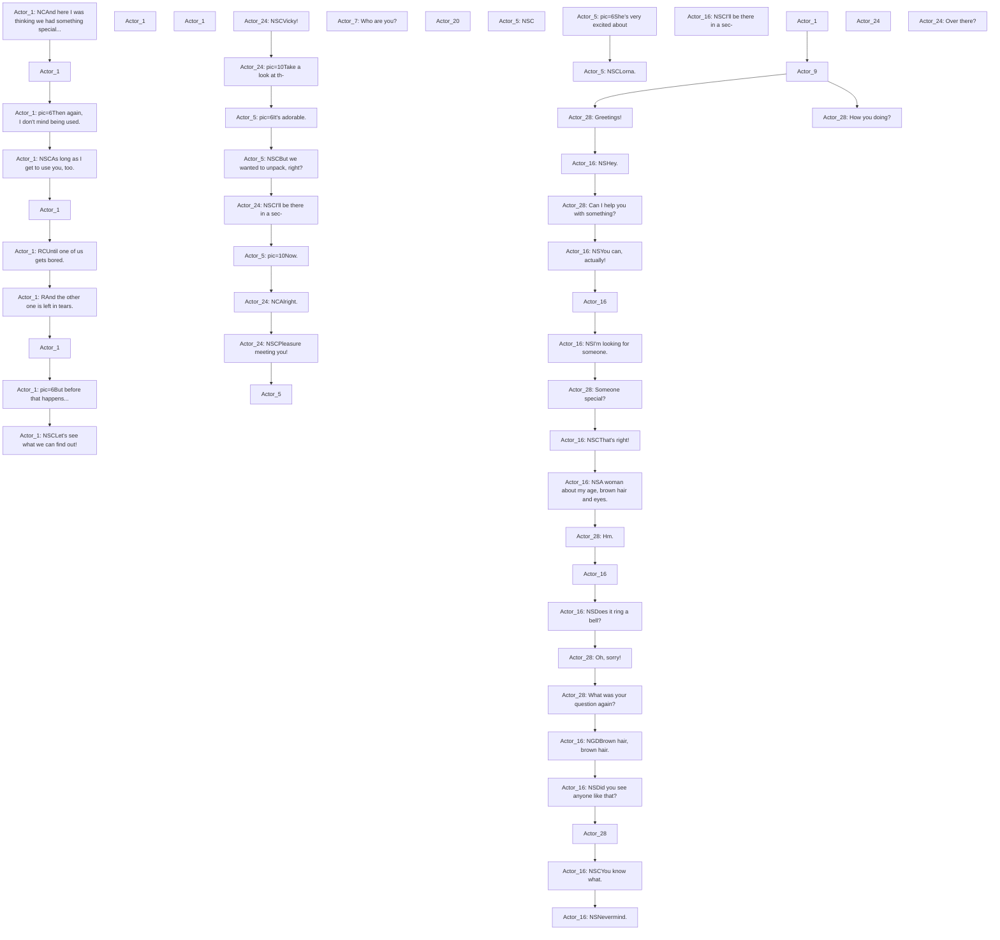

# Characters/Avgust

```mermaid
graph TD
    44_0["Actor_1"]
    44_19["Actor_1"]
    44_26["Actor_1"]
    44_29["Actor_1: NCAnd here I was thinking we had something special..."]
    44_30["Actor_1"]
    44_31["Actor_1: pic=6Then again, I don't mind being used."]
    44_32["Actor_1: NSCAs long as I get to use you, too."]
    44_33["Actor_1"]
    44_34["Actor_1: pic=6But before that happens..."]
    44_36["Actor_1: NSCLet's see what we can find out!"]
    44_40["Actor_1: RCUntil one of us gets bored."]
    44_41["Actor_1: RAnd the other one is left in tears."]
    44_42["Actor_1"]
    44_75["Actor_7: Who are you?"]
    44_80["Actor_20"]
    44_83["Actor_9"]
    44_86["Actor_5: NSC"]
    44_88["Actor_5: NSCLorna."]
    44_90["Actor_24: NSCVicky!"]
    44_91["Actor_24: pic=10Take a look at th-"]
    44_92["Actor_5: pic=6It's adorable."]
    44_93["Actor_5: NSCBut we wanted to unpack, right?"]
    44_94["Actor_24: NSCI'll be there in a sec-"]
    44_95["Actor_5: pic=10Now."]
    44_96["Actor_16: NSCI'll be there in a sec-"]
    44_97["Actor_24: NCAlright."]
    44_98["Actor_24: NSCPleasure meeting you!"]
    44_102["Actor_5: pic=6She's very excited about "]
    44_104["Actor_24"]
    44_110["Actor_24: Over there?"]
    44_146["Actor_5"]
    44_149["Actor_28: Greetings!"]
    44_150["Actor_28: How you doing?"]
    44_151["Actor_16: NSHey."]
    44_152["Actor_28: Can I help you with something?"]
    44_153["Actor_16: NSYou can, actually!"]
    44_154["Actor_16"]
    44_155["Actor_16: NSI'm looking for someone."]
    44_156["Actor_28: Someone special?"]
    44_157["Actor_16: NSCThat's right!"]
    44_158["Actor_28: Hm."]
    44_159["Actor_16: NSA woman about my age, brown hair and eyes."]
    44_160["Actor_16: NSDoes it ring a bell?"]
    44_161["Actor_28: Oh, sorry!"]
    44_162["Actor_16"]
    44_163["Actor_28: What was your question again?"]
    44_164["Actor_16: NGDBrown hair, brown hair."]
    44_166["Actor_16: NSCYou know what."]
    44_167["Actor_28"]
    44_168["Actor_16: NSNevermind."]
    44_169["Actor_16: NSDid you see anyone like that?"]
    44_0 --> 44_83
    44_29 --> 44_30
    44_30 --> 44_31
    44_31 --> 44_32
    44_32 --> 44_33
    44_33 --> 44_40
    44_34 --> 44_36
    44_40 --> 44_41
    44_41 --> 44_42
    44_42 --> 44_34
    44_83 --> 44_149
    44_83 --> 44_150
    44_90 --> 44_91
    44_91 --> 44_92
    44_92 --> 44_93
    44_93 --> 44_94
    44_94 --> 44_95
    44_95 --> 44_97
    44_97 --> 44_98
    44_98 --> 44_146
    44_102 --> 44_88
    44_149 --> 44_151
    44_151 --> 44_152
    44_152 --> 44_153
    44_153 --> 44_154
    44_154 --> 44_155
    44_155 --> 44_156
    44_156 --> 44_157
    44_157 --> 44_159
    44_158 --> 44_162
    44_159 --> 44_158
    44_160 --> 44_161
    44_161 --> 44_163
    44_162 --> 44_160
    44_163 --> 44_164
    44_164 --> 44_169
    44_166 --> 44_168
    44_167 --> 44_166
    44_169 --> 44_167
```