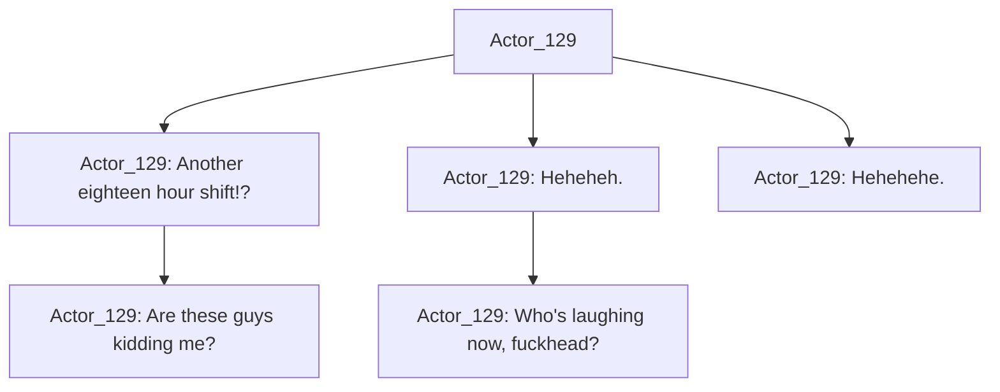

# Characters/Barclay

```mermaid
graph TD
    135_0["Actor_129"]
    135_1["Actor_129: Another eighteen hour shift!?"]
    135_2["Actor_129: Are these guys kidding me?"]
    135_3["Actor_129: Heheheh."]
    135_4["Actor_129: Who's laughing now, fuckhead?"]
    135_5["Actor_129: Hehehehe."]
    135_0 --> 135_1
    135_0 --> 135_3
    135_0 --> 135_5
    135_1 --> 135_2
    135_3 --> 135_4
```