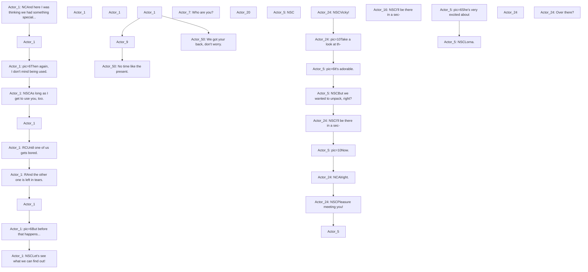

# Characters/Bashkim

```mermaid
graph TD
    78_0["Actor_1"]
    78_1["Actor_50: We got your back, don't worry."]
    78_19["Actor_1"]
    78_26["Actor_1"]
    78_29["Actor_1: NCAnd here I was thinking we had something special..."]
    78_30["Actor_1"]
    78_31["Actor_1: pic=6Then again, I don't mind being used."]
    78_32["Actor_1: NSCAs long as I get to use you, too."]
    78_33["Actor_1"]
    78_34["Actor_1: pic=6But before that happens..."]
    78_36["Actor_1: NSCLet's see what we can find out!"]
    78_40["Actor_1: RCUntil one of us gets bored."]
    78_41["Actor_1: RAnd the other one is left in tears."]
    78_42["Actor_1"]
    78_75["Actor_7: Who are you?"]
    78_80["Actor_20"]
    78_83["Actor_9"]
    78_86["Actor_5: NSC"]
    78_88["Actor_5: NSCLorna."]
    78_90["Actor_24: NSCVicky!"]
    78_91["Actor_24: pic=10Take a look at th-"]
    78_92["Actor_5: pic=6It's adorable."]
    78_93["Actor_5: NSCBut we wanted to unpack, right?"]
    78_94["Actor_24: NSCI'll be there in a sec-"]
    78_95["Actor_5: pic=10Now."]
    78_96["Actor_16: NSCI'll be there in a sec-"]
    78_97["Actor_24: NCAlright."]
    78_98["Actor_24: NSCPleasure meeting you!"]
    78_102["Actor_5: pic=6She's very excited about "]
    78_104["Actor_24"]
    78_110["Actor_24: Over there?"]
    78_146["Actor_5"]
    78_149["Actor_50: No time like the present."]
    78_0 --> 78_83
    78_0 --> 78_1
    78_29 --> 78_30
    78_30 --> 78_31
    78_31 --> 78_32
    78_32 --> 78_33
    78_33 --> 78_40
    78_34 --> 78_36
    78_40 --> 78_41
    78_41 --> 78_42
    78_42 --> 78_34
    78_83 --> 78_149
    78_90 --> 78_91
    78_91 --> 78_92
    78_92 --> 78_93
    78_93 --> 78_94
    78_94 --> 78_95
    78_95 --> 78_97
    78_97 --> 78_98
    78_98 --> 78_146
    78_102 --> 78_88
```