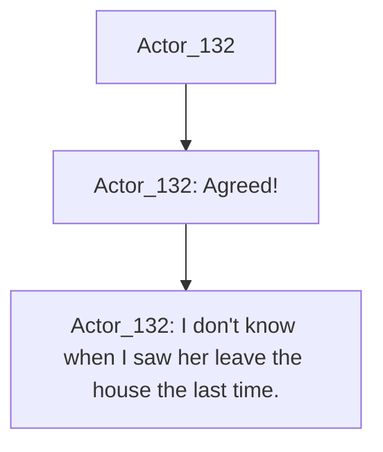

# Characters/Ben

```mermaid
graph TD
    138_0["Actor_132"]
    138_1["Actor_132: Agreed!"]
    138_2["Actor_132: I don't know when I saw her leave the house the last time."]
    138_0 --> 138_1
    138_1 --> 138_2
```