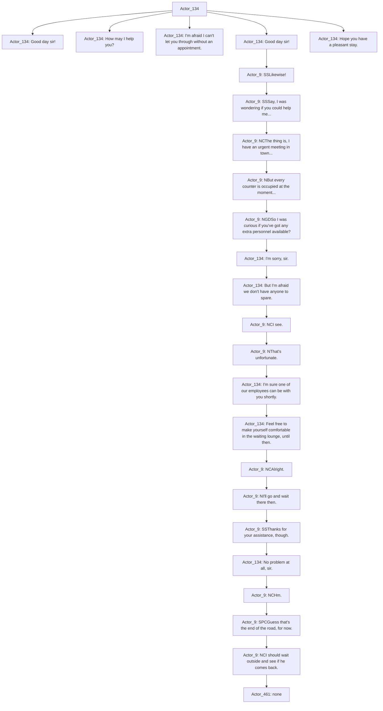

# Characters/Beniamin

```mermaid
graph TD
    140_0["Actor_134"]
    140_1["Actor_134: Good day sir!"]
    140_2["Actor_134: How may I help you?"]
    140_3["Actor_134: I'm afraid I can't let you through without an appointment."]
    140_4["Actor_134: Good day sir!"]
    140_5["Actor_9: SSLikewise!"]
    140_6["Actor_9: SSSay, I was wondering if you could help me..."]
    140_7["Actor_9: NCThe thing is, I have an urgent meeting in town..."]
    140_8["Actor_9: NBut every counter is occupied at the moment..."]
    140_9["Actor_9: NGDSo I was curious if you've got any extra personnel available?"]
    140_10["Actor_134: I'm sorry, sir."]
    140_11["Actor_134: But I'm afraid we don't have anyone to spare."]
    140_12["Actor_9: NCI see."]
    140_13["Actor_9: NThat's unfortunate."]
    140_14["Actor_134: I'm sure one of our employees can be with you shortly."]
    140_15["Actor_134: Feel free to make yourself comfortable in the waiting lounge, until then."]
    140_16["Actor_9: NCAlright."]
    140_17["Actor_9: NI'll go and wait there then."]
    140_18["Actor_9: SSThanks for your assistance, though."]
    140_19["Actor_134: No problem at all, sir."]
    140_20["Actor_9: NCHm."]
    140_21["Actor_9: SPCGuess that's the end of the road, for now."]
    140_22["Actor_9: NCI should wait outside and see if he comes back."]
    140_23["Actor_461: none"]
    140_24["Actor_134: Hope you have a pleasant stay."]
    140_0 --> 140_1
    140_0 --> 140_2
    140_0 --> 140_3
    140_0 --> 140_4
    140_0 --> 140_24
    140_4 --> 140_5
    140_5 --> 140_6
    140_6 --> 140_7
    140_7 --> 140_8
    140_8 --> 140_9
    140_9 --> 140_10
    140_10 --> 140_11
    140_11 --> 140_12
    140_12 --> 140_13
    140_13 --> 140_14
    140_14 --> 140_15
    140_15 --> 140_16
    140_16 --> 140_17
    140_17 --> 140_18
    140_18 --> 140_19
    140_19 --> 140_20
    140_20 --> 140_21
    140_21 --> 140_22
    140_22 --> 140_23
```