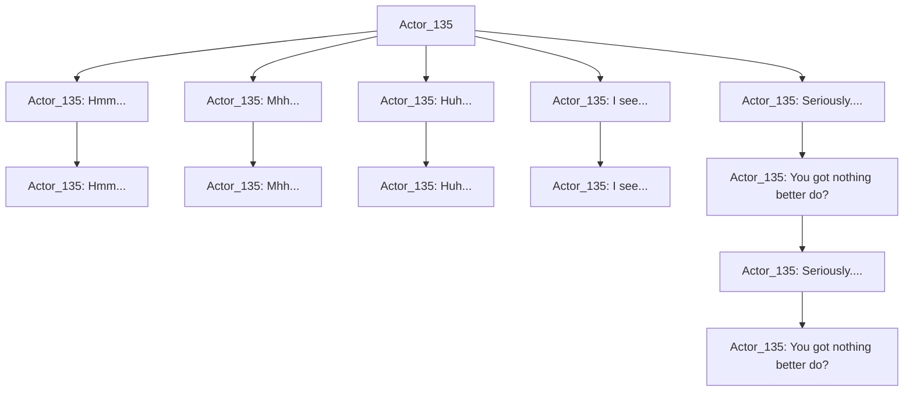

# Characters/Bernadine

```mermaid
graph TD
    141_0["Actor_135"]
    141_1["Actor_135: Hmm..."]
    141_2["Actor_135: Hmm..."]
    141_3["Actor_135: Mhh..."]
    141_4["Actor_135: Mhh..."]
    141_5["Actor_135: Huh..."]
    141_6["Actor_135: Huh..."]
    141_7["Actor_135: I see..."]
    141_8["Actor_135: I see..."]
    141_9["Actor_135: Seriously...."]
    141_10["Actor_135: You got nothing better do?"]
    141_11["Actor_135: Seriously...."]
    141_12["Actor_135: You got nothing better do?"]
    141_0 --> 141_1
    141_0 --> 141_3
    141_0 --> 141_5
    141_0 --> 141_7
    141_0 --> 141_9
    141_1 --> 141_2
    141_3 --> 141_4
    141_5 --> 141_6
    141_7 --> 141_8
    141_9 --> 141_10
    141_10 --> 141_11
    141_11 --> 141_12
```