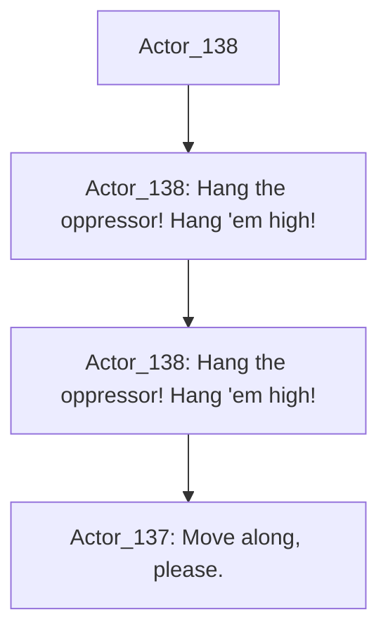

# Characters/Bohdan

```mermaid
graph TD
    142_0["Actor_138"]
    142_1["Actor_138: Hang the oppressor! Hang 'em high!"]
    142_2["Actor_138: Hang the oppressor! Hang 'em high!"]
    142_3["Actor_137: Move along, please."]
    142_0 --> 142_1
    142_1 --> 142_2
    142_2 --> 142_3
```