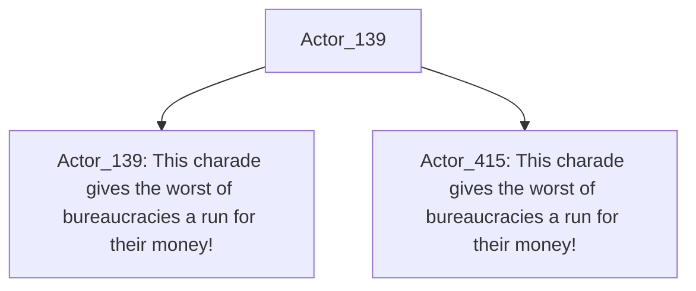

# Characters/Bohuslav

```mermaid
graph TD
    143_0["Actor_139"]
    143_1["Actor_139: This charade gives the worst of bureaucracies a run for their money!"]
    143_2["Actor_415: This charade gives the worst of bureaucracies a run for their money!"]
    143_0 --> 143_1
    143_0 --> 143_2
```