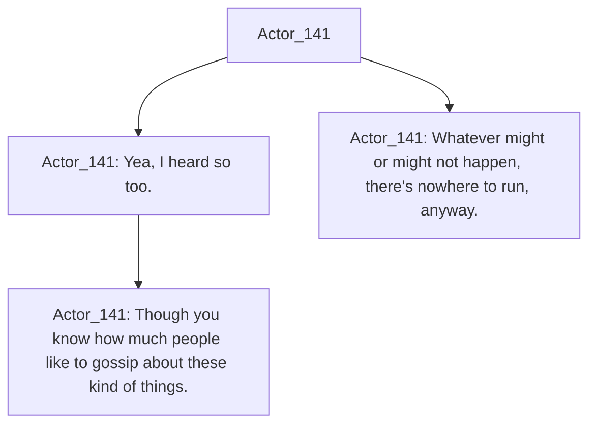

# Characters/Brett

```mermaid
graph TD
    145_0["Actor_141"]
    145_1["Actor_141: Yea, I heard so too."]
    145_2["Actor_141: Though you know how much people like to gossip about these kind of things."]
    145_3["Actor_141: Whatever might or might not happen, there's nowhere to run, anyway."]
    145_0 --> 145_1
    145_0 --> 145_3
    145_1 --> 145_2
```