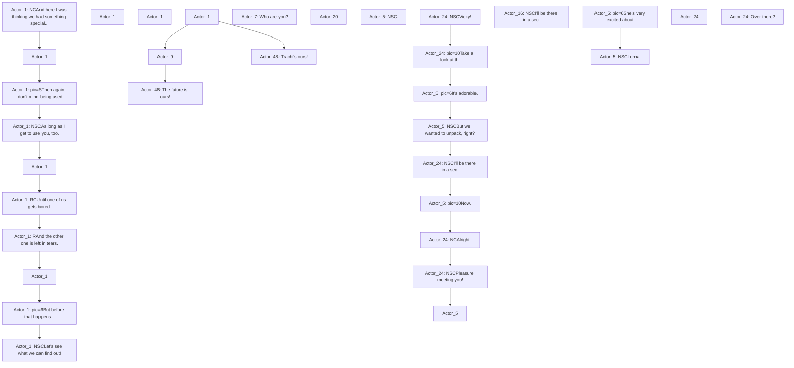

# Characters/Brin

```mermaid
graph TD
    76_0["Actor_1"]
    76_1["Actor_48: Trachi's ours!"]
    76_19["Actor_1"]
    76_26["Actor_1"]
    76_29["Actor_1: NCAnd here I was thinking we had something special..."]
    76_30["Actor_1"]
    76_31["Actor_1: pic=6Then again, I don't mind being used."]
    76_32["Actor_1: NSCAs long as I get to use you, too."]
    76_33["Actor_1"]
    76_34["Actor_1: pic=6But before that happens..."]
    76_36["Actor_1: NSCLet's see what we can find out!"]
    76_40["Actor_1: RCUntil one of us gets bored."]
    76_41["Actor_1: RAnd the other one is left in tears."]
    76_42["Actor_1"]
    76_75["Actor_7: Who are you?"]
    76_80["Actor_20"]
    76_83["Actor_9"]
    76_86["Actor_5: NSC"]
    76_88["Actor_5: NSCLorna."]
    76_90["Actor_24: NSCVicky!"]
    76_91["Actor_24: pic=10Take a look at th-"]
    76_92["Actor_5: pic=6It's adorable."]
    76_93["Actor_5: NSCBut we wanted to unpack, right?"]
    76_94["Actor_24: NSCI'll be there in a sec-"]
    76_95["Actor_5: pic=10Now."]
    76_96["Actor_16: NSCI'll be there in a sec-"]
    76_97["Actor_24: NCAlright."]
    76_98["Actor_24: NSCPleasure meeting you!"]
    76_102["Actor_5: pic=6She's very excited about "]
    76_104["Actor_24"]
    76_110["Actor_24: Over there?"]
    76_146["Actor_5"]
    76_149["Actor_48: The future is ours!"]
    76_0 --> 76_83
    76_0 --> 76_1
    76_29 --> 76_30
    76_30 --> 76_31
    76_31 --> 76_32
    76_32 --> 76_33
    76_33 --> 76_40
    76_34 --> 76_36
    76_40 --> 76_41
    76_41 --> 76_42
    76_42 --> 76_34
    76_83 --> 76_149
    76_90 --> 76_91
    76_91 --> 76_92
    76_92 --> 76_93
    76_93 --> 76_94
    76_94 --> 76_95
    76_95 --> 76_97
    76_97 --> 76_98
    76_98 --> 76_146
    76_102 --> 76_88
```