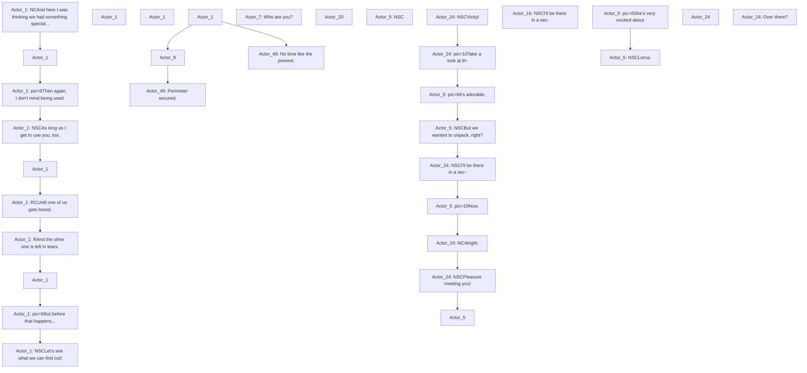

# Characters/Bronislav

```mermaid
graph TD
    77_0["Actor_1"]
    77_1["Actor_49: No time like the present."]
    77_19["Actor_1"]
    77_26["Actor_1"]
    77_29["Actor_1: NCAnd here I was thinking we had something special..."]
    77_30["Actor_1"]
    77_31["Actor_1: pic=6Then again, I don't mind being used."]
    77_32["Actor_1: NSCAs long as I get to use you, too."]
    77_33["Actor_1"]
    77_34["Actor_1: pic=6But before that happens..."]
    77_36["Actor_1: NSCLet's see what we can find out!"]
    77_40["Actor_1: RCUntil one of us gets bored."]
    77_41["Actor_1: RAnd the other one is left in tears."]
    77_42["Actor_1"]
    77_75["Actor_7: Who are you?"]
    77_80["Actor_20"]
    77_83["Actor_9"]
    77_86["Actor_5: NSC"]
    77_88["Actor_5: NSCLorna."]
    77_90["Actor_24: NSCVicky!"]
    77_91["Actor_24: pic=10Take a look at th-"]
    77_92["Actor_5: pic=6It's adorable."]
    77_93["Actor_5: NSCBut we wanted to unpack, right?"]
    77_94["Actor_24: NSCI'll be there in a sec-"]
    77_95["Actor_5: pic=10Now."]
    77_96["Actor_16: NSCI'll be there in a sec-"]
    77_97["Actor_24: NCAlright."]
    77_98["Actor_24: NSCPleasure meeting you!"]
    77_102["Actor_5: pic=6She's very excited about "]
    77_104["Actor_24"]
    77_110["Actor_24: Over there?"]
    77_146["Actor_5"]
    77_149["Actor_49: Perimeter secured."]
    77_0 --> 77_83
    77_0 --> 77_1
    77_29 --> 77_30
    77_30 --> 77_31
    77_31 --> 77_32
    77_32 --> 77_33
    77_33 --> 77_40
    77_34 --> 77_36
    77_40 --> 77_41
    77_41 --> 77_42
    77_42 --> 77_34
    77_83 --> 77_149
    77_90 --> 77_91
    77_91 --> 77_92
    77_92 --> 77_93
    77_93 --> 77_94
    77_94 --> 77_95
    77_95 --> 77_97
    77_97 --> 77_98
    77_98 --> 77_146
    77_102 --> 77_88
```