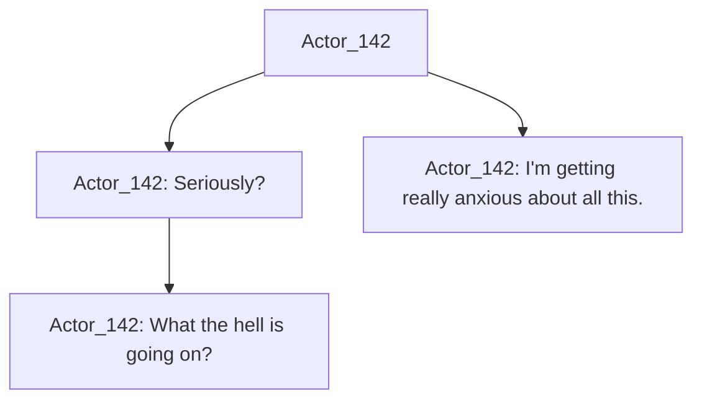

# Characters/Brunello

```mermaid
graph TD
    146_0["Actor_142"]
    146_1["Actor_142: Seriously?"]
    146_2["Actor_142: What the hell is going on?"]
    146_3["Actor_142: I'm getting really anxious about all this."]
    146_0 --> 146_1
    146_0 --> 146_3
    146_1 --> 146_2
```