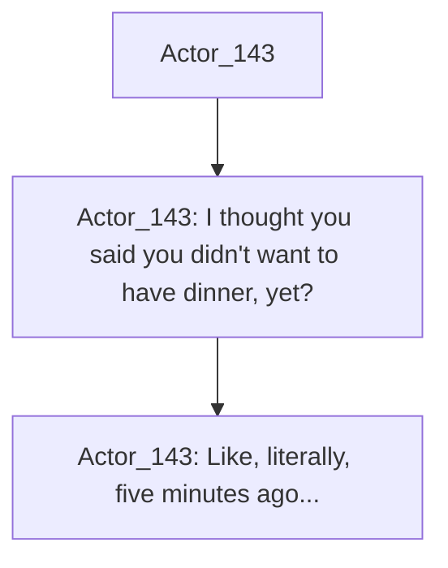

# Characters/Carl

```mermaid
graph TD
    147_0["Actor_143"]
    147_1["Actor_143: I thought you said you didn't want to have dinner, yet?"]
    147_2["Actor_143: Like, literally, five minutes ago..."]
    147_0 --> 147_1
    147_1 --> 147_2
```