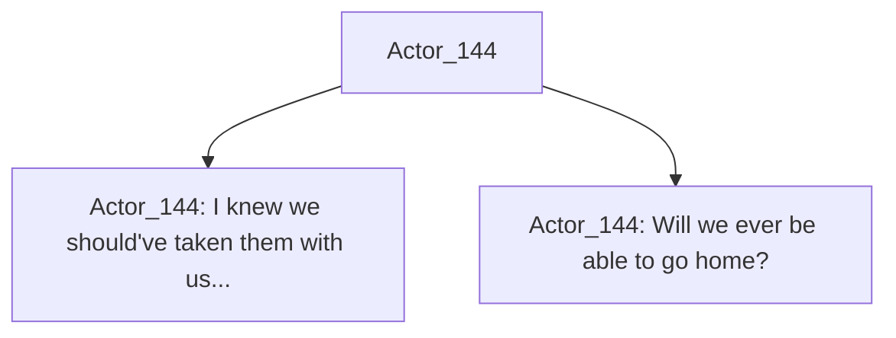

# Characters/Catriona

```mermaid
graph TD
    148_0["Actor_144"]
    148_1["Actor_144: I knew we should've taken them with us..."]
    148_2["Actor_144: Will we ever be able to go home?"]
    148_0 --> 148_1
    148_0 --> 148_2
```