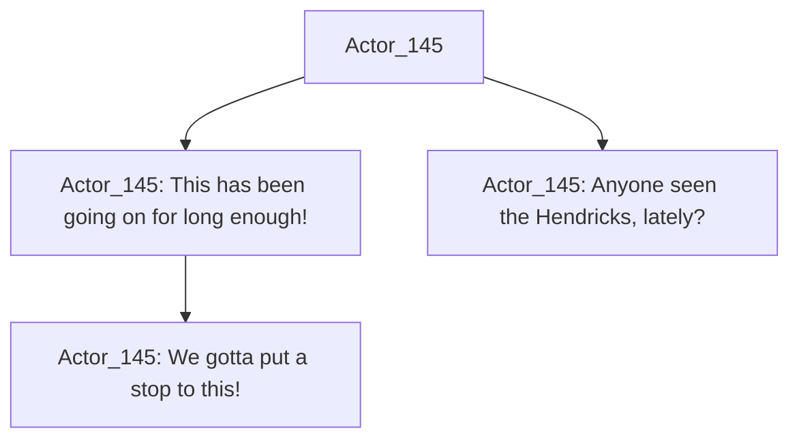

# Characters/Cesar

```mermaid
graph TD
    149_0["Actor_145"]
    149_1["Actor_145: This has been going on for long enough!"]
    149_2["Actor_145: We gotta put a stop to this!"]
    149_3["Actor_145: Anyone seen the Hendricks, lately?"]
    149_0 --> 149_1
    149_0 --> 149_3
    149_1 --> 149_2
```