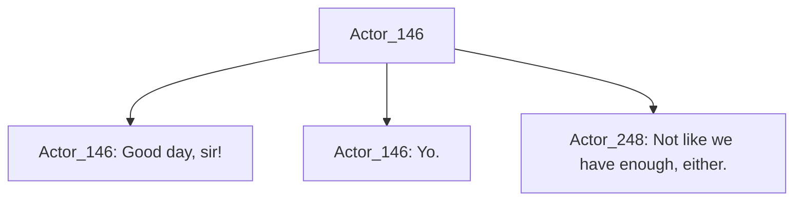

# Characters/Cesare

```mermaid
graph TD
    150_0["Actor_146"]
    150_1["Actor_146: Good day, sir!"]
    150_2["Actor_146: Yo."]
    150_3["Actor_248: Not like we have enough, either."]
    150_0 --> 150_1
    150_0 --> 150_2
    150_0 --> 150_3
```