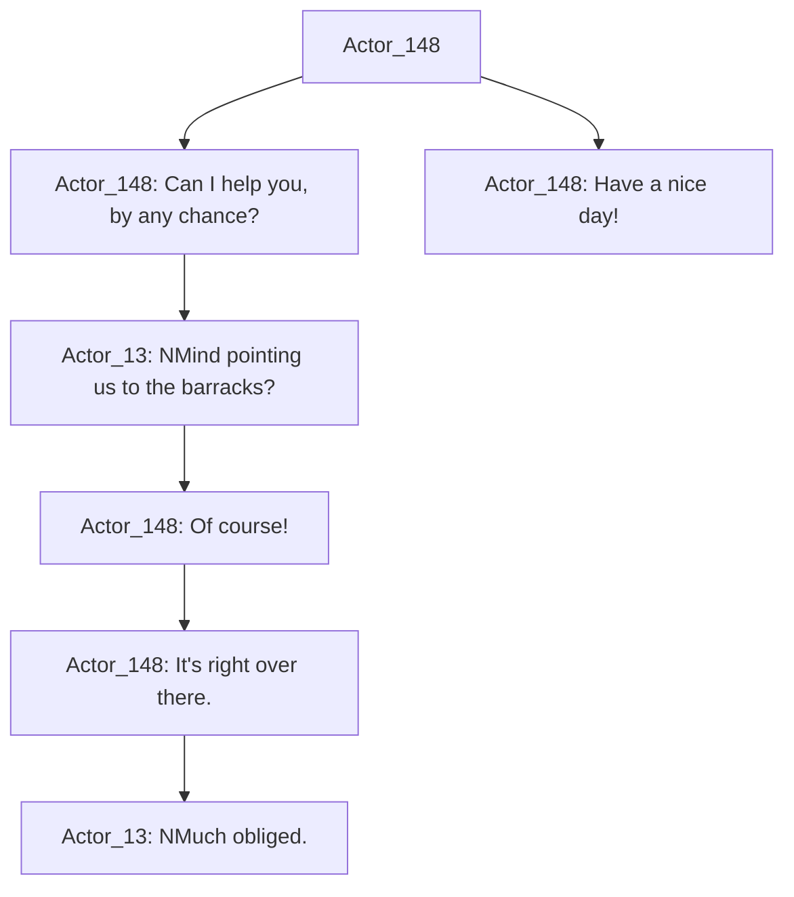

# Characters/Chrysanthos

```mermaid
graph TD
    152_0["Actor_148"]
    152_1["Actor_148: Can I help you, by any chance?"]
    152_2["Actor_13: NMind pointing us to the barracks?"]
    152_3["Actor_148: Of course!"]
    152_4["Actor_148: It's right over there."]
    152_5["Actor_13: NMuch obliged."]
    152_6["Actor_148: Have a nice day!"]
    152_0 --> 152_1
    152_0 --> 152_6
    152_1 --> 152_2
    152_2 --> 152_3
    152_3 --> 152_4
    152_4 --> 152_5
```