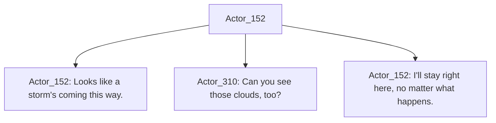

# Characters/Colin

```mermaid
graph TD
    156_0["Actor_152"]
    156_1["Actor_152: Looks like a storm's coming this way."]
    156_2["Actor_310: Can you see those clouds, too?"]
    156_3["Actor_152: I'll stay right here, no matter what happens."]
    156_0 --> 156_1
    156_0 --> 156_2
    156_0 --> 156_3
```