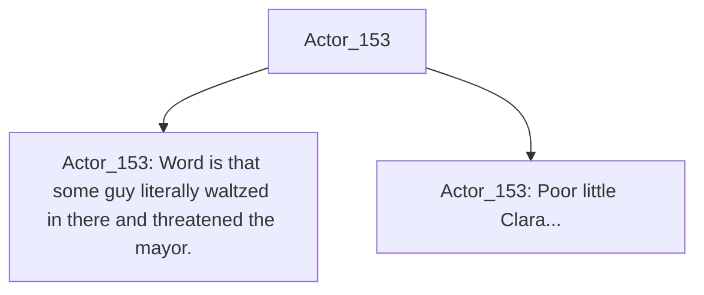

# Characters/Constantin

```mermaid
graph TD
    157_0["Actor_153"]
    157_1["Actor_153: Word is that some guy literally waltzed in there and threatened the mayor."]
    157_2["Actor_153: Poor little Clara..."]
    157_0 --> 157_1
    157_0 --> 157_2
```