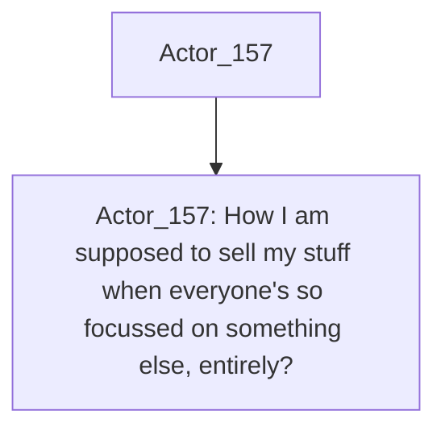

# Characters/Cosme

```mermaid
graph TD
    160_0["Actor_157"]
    160_1["Actor_157: How I am supposed to sell my stuff when everyone's so focussed on something else, entirely?"]
    160_0 --> 160_1
```