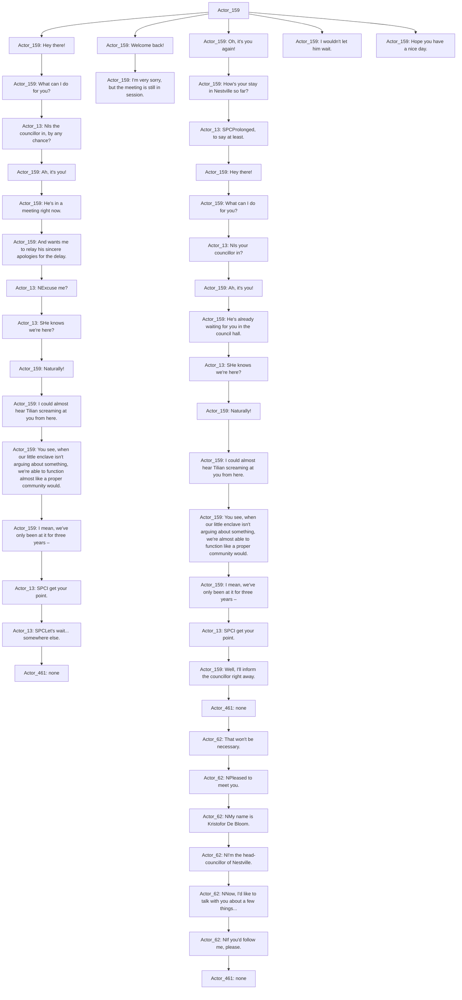

# Characters/Costin

```mermaid
graph TD
    162_0["Actor_159"]
    162_1["Actor_159: Hey there!"]
    162_2["Actor_159: What can I do for you?"]
    162_3["Actor_13: NIs the councillor in, by any chance?"]
    162_4["Actor_159: Ah, it's you!"]
    162_5["Actor_159: He's in a meeting right now."]
    162_6["Actor_159: And wants me to relay his sincere apologies for the delay."]
    162_7["Actor_13: NExcuse me?"]
    162_8["Actor_13: SHe knows we're here?"]
    162_9["Actor_159: Naturally!"]
    162_10["Actor_159: I could almost hear Tilian screaming at you from here."]
    162_11["Actor_159: You see, when our little enclave isn't arguing about something, we're able to function almost like a proper community would."]
    162_12["Actor_159: I mean, we've only been at it for three years –"]
    162_13["Actor_13: SPCI get your point."]
    162_14["Actor_13: SPCLet's wait... somewhere else."]
    162_15["Actor_461: none"]
    162_16["Actor_159: Welcome back!"]
    162_17["Actor_159: I'm very sorry, but the meeting is still in session."]
    162_18["Actor_159: Oh, it's you again!"]
    162_19["Actor_159: How's your stay in Nestville so far?"]
    162_20["Actor_13: SPCProlonged, to say at least."]
    162_21["Actor_159: Hey there!"]
    162_22["Actor_159: What can I do for you?"]
    162_23["Actor_13: NIs your councillor in?"]
    162_24["Actor_159: Ah, it's you!"]
    162_25["Actor_159: He's already waiting for you in the council hall."]
    162_26["Actor_13: SHe knows we're here?"]
    162_27["Actor_159: Naturally!"]
    162_28["Actor_159: I could almost hear Tilian screaming at you from here."]
    162_29["Actor_159: You see, when our little enclave isn't arguing about something, we're almost able to function like a proper community would."]
    162_30["Actor_159: I mean, we've only been at it for three years –"]
    162_31["Actor_13: SPCI get your point."]
    162_32["Actor_159: Well, I'll inform the councillor right away."]
    162_33["Actor_461: none"]
    162_34["Actor_62: That won't be necessary."]
    162_35["Actor_62: NPleased to meet you."]
    162_36["Actor_62: NMy name is Kristofor De Bloom."]
    162_37["Actor_62: NI'm the head-councillor of Nestville."]
    162_38["Actor_62: NNow, I'd like to talk with you about a few things..."]
    162_39["Actor_62: NIf you'd follow me, please."]
    162_40["Actor_461: none"]
    162_41["Actor_159: I wouldn't let him wait."]
    162_42["Actor_159: Hope you have a nice day."]
    162_0 --> 162_1
    162_0 --> 162_16
    162_0 --> 162_18
    162_0 --> 162_41
    162_0 --> 162_42
    162_1 --> 162_2
    162_2 --> 162_3
    162_3 --> 162_4
    162_4 --> 162_5
    162_5 --> 162_6
    162_6 --> 162_7
    162_7 --> 162_8
    162_8 --> 162_9
    162_9 --> 162_10
    162_10 --> 162_11
    162_11 --> 162_12
    162_12 --> 162_13
    162_13 --> 162_14
    162_14 --> 162_15
    162_16 --> 162_17
    162_18 --> 162_19
    162_19 --> 162_20
    162_20 --> 162_21
    162_21 --> 162_22
    162_22 --> 162_23
    162_23 --> 162_24
    162_24 --> 162_25
    162_25 --> 162_26
    162_26 --> 162_27
    162_27 --> 162_28
    162_28 --> 162_29
    162_29 --> 162_30
    162_30 --> 162_31
    162_31 --> 162_32
    162_32 --> 162_33
    162_33 --> 162_34
    162_34 --> 162_35
    162_35 --> 162_36
    162_36 --> 162_37
    162_37 --> 162_38
    162_38 --> 162_39
    162_39 --> 162_40
```