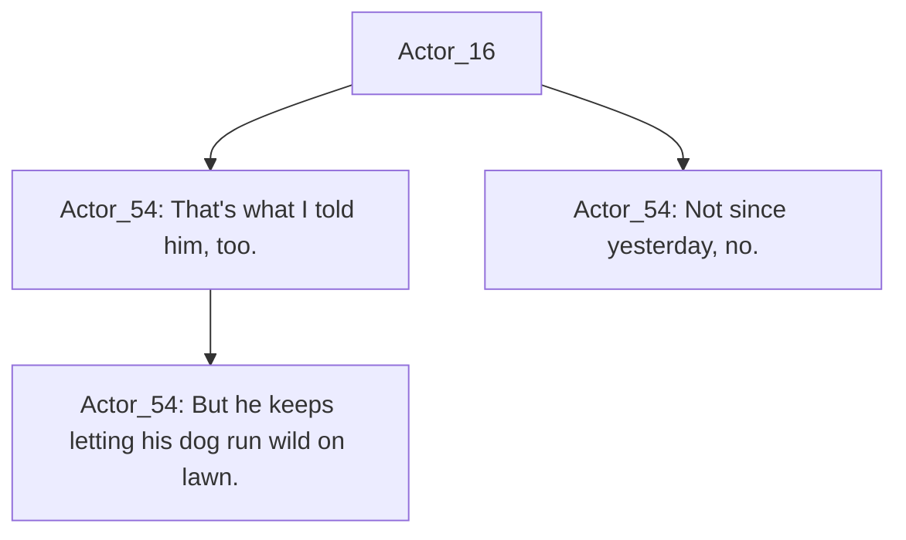

# Characters/Craig

```mermaid
graph TD
    79_0["Actor_16"]
    79_1["Actor_54: That's what I told him, too."]
    79_2["Actor_54: But he keeps letting his dog run wild on lawn."]
    79_3["Actor_54: Not since yesterday, no."]
    79_0 --> 79_1
    79_0 --> 79_3
    79_1 --> 79_2
```