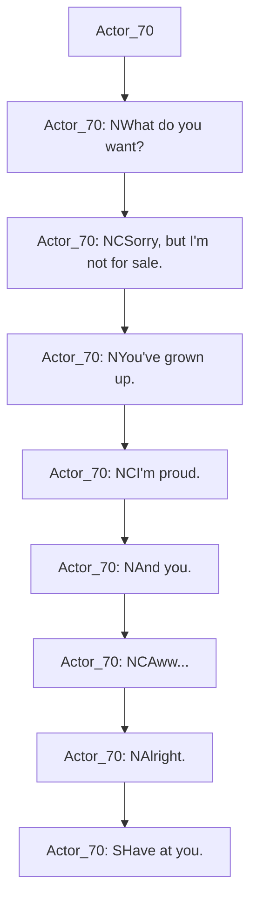

# Characters/Crius

```mermaid
graph TD
    163_0["Actor_70"]
    163_1["Actor_70: NWhat do you want?"]
    163_2["Actor_70: NCSorry, but I'm not for sale."]
    163_3["Actor_70: NYou've grown up."]
    163_4["Actor_70: NCI'm proud."]
    163_5["Actor_70: NAnd you."]
    163_6["Actor_70: NCAww..."]
    163_7["Actor_70: NAlright."]
    163_8["Actor_70: SHave at you."]
    163_0 --> 163_1
    163_1 --> 163_2
    163_2 --> 163_3
    163_3 --> 163_4
    163_4 --> 163_5
    163_5 --> 163_6
    163_6 --> 163_7
    163_7 --> 163_8
```