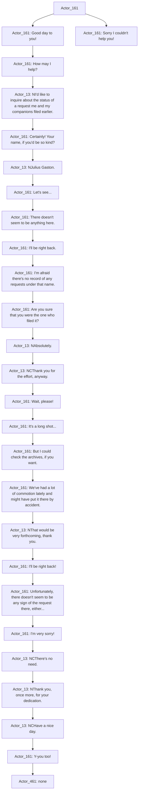

# Characters/Dajana

```mermaid
graph TD
    165_0["Actor_161"]
    165_1["Actor_161: Good day to you!"]
    165_2["Actor_161: How may I help?"]
    165_3["Actor_13: NI'd like to inquire about the status of a request me and my companions filed earlier."]
    165_4["Actor_161: Certainly! Your name, if you'd be so kind?"]
    165_5["Actor_13: NJulius Gaston."]
    165_6["Actor_161: Let's see..."]
    165_7["Actor_161: There doesn't seem to be anything here."]
    165_8["Actor_161: I'll be right back."]
    165_9["Actor_161: I'm afraid there's no record of any requests under that name."]
    165_10["Actor_161: Are you sure that you were the one who filed it?"]
    165_11["Actor_13: NAbsolutely."]
    165_12["Actor_13: NCThank you for the effort, anyway."]
    165_13["Actor_161: Wait, please!"]
    165_14["Actor_161: It's a long shot..."]
    165_15["Actor_161: But I could check the archives, if you want."]
    165_16["Actor_161: We've had a lot of commotion lately and might have put it there by accident."]
    165_17["Actor_13: NThat would be very forthcoming, thank you."]
    165_18["Actor_161: I'll be right back!"]
    165_19["Actor_161: Unfortunately, there doesn't seem to be any sign of the request there, either..."]
    165_20["Actor_161: I'm very sorry!"]
    165_21["Actor_13: NCThere's no need."]
    165_22["Actor_13: NThank you, once more, for your dedication."]
    165_23["Actor_13: NCHave a nice day."]
    165_24["Actor_161: Y-you too!"]
    165_25["Actor_461: none"]
    165_26["Actor_161: Sorry I couldn't help you!"]
    165_0 --> 165_1
    165_0 --> 165_26
    165_1 --> 165_2
    165_2 --> 165_3
    165_3 --> 165_4
    165_4 --> 165_5
    165_5 --> 165_6
    165_6 --> 165_7
    165_7 --> 165_8
    165_8 --> 165_9
    165_9 --> 165_10
    165_10 --> 165_11
    165_11 --> 165_12
    165_12 --> 165_13
    165_13 --> 165_14
    165_14 --> 165_15
    165_15 --> 165_16
    165_16 --> 165_17
    165_17 --> 165_18
    165_18 --> 165_19
    165_19 --> 165_20
    165_20 --> 165_21
    165_21 --> 165_22
    165_22 --> 165_23
    165_23 --> 165_24
    165_24 --> 165_25
```